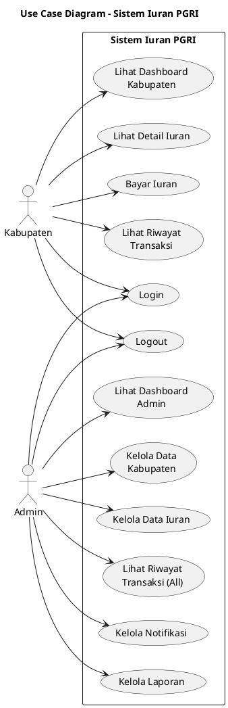

# 📊 Use Case Diagram - Sistem Iuran PGRI

**Tanggal:** 6 Januari 2026  
**Versi:** FINAL - Layak Laporan  
**Status:** ✅ Approved

---

## 🎯 Aktor dalam Sistem

1. **Kabupaten** - Pengguna yang melakukan pembayaran iuran
2. **Admin** - Pengguna yang mengelola sistem

---

## 📋 Use Case Diagram

```
┌──────────────────────────────────────────────────────────────────┐
│                     SISTEM IURAN PGRI                            │
├──────────────────────────────────────────────────────────────────┤
│                                                                  │
│   ┌─────────┐                                                    │
│   │KABUPATEN│                                                    │
│   └────┬────┘                                                    │
│        │                                                         │
│        ├──► Login                                                │
│        │                                                         │
│        ├──► Lihat Dashboard Kabupaten                            │
│        │                                                         │
│        ├──► Lihat Detail Iuran                                   │
│        │                                                         │
│        ├──► Bayar Iuran                                          │
│        │                                                         │
│        ├──► Lihat Riwayat Transaksi                              │
│        │                                                         │
│        └──► Logout                                               │
│                                                                  │
│                                                                  │
│   ┌─────────┐                                                    │
│   │  ADMIN  │                                                    │
│   └────┬────┘                                                    │
│        │                                                         │
│        ├──► Login                                                │
│        │                                                         │
│        ├──► Lihat Dashboard Admin                                │
│        │                                                         │
│        ├──► Kelola Data Kabupaten                                │
│        │                                                         │
│        ├──► Kelola Data Iuran                                    │
│        │                                                         │
│        ├──► Lihat Riwayat Transaksi                              │
│        │                                                         │
│        ├──► Kelola Notifikasi                                    │
│        │                                                         │
│        ├──► Kelola Laporan                                       │
│        │                                                         │
│        └──► Logout                                               │
│                                                                  │
└──────────────────────────────────────────────────────────────────┘
```

---

## 🎨 PlantUML Code



---

## 📝 Deskripsi Use Case

### 🔵 Use Case KABUPATEN

#### **Login**
- **Aktor:** Kabupaten
- **Deskripsi:** Kabupaten melakukan autentikasi untuk masuk ke sistem
- **Precondition:** Kabupaten memiliki akun yang terdaftar
- **Postcondition:** Kabupaten berhasil masuk dan diarahkan ke dashboard

#### **Lihat Dashboard Kabupaten**
- **Aktor:** Kabupaten
- **Deskripsi:** Kabupaten melihat ringkasan informasi transaksi dan statistik pembayaran
- **Precondition:** Kabupaten sudah login
- **Postcondition:** Dashboard ditampilkan dengan informasi terkini

#### **Lihat Detail Iuran**
- **Aktor:** Kabupaten
- **Deskripsi:** Kabupaten melihat detail informasi iuran yang harus dibayar
- **Precondition:** Kabupaten sudah login
- **Postcondition:** Detail iuran ditampilkan

#### **Bayar Iuran**
- **Aktor:** Kabupaten
- **Deskripsi:** Kabupaten melakukan pembayaran iuran PGRI
- **Precondition:** Kabupaten sudah login
- **Postcondition:** Transaksi pembayaran tercatat dalam sistem

#### **Lihat Riwayat Transaksi**
- **Aktor:** Kabupaten
- **Deskripsi:** Kabupaten melihat daftar semua transaksi pembayaran yang pernah dilakukan
- **Precondition:** Kabupaten sudah login
- **Postcondition:** Daftar transaksi ditampilkan

#### **Logout**
- **Aktor:** Kabupaten
- **Deskripsi:** Kabupaten mengakhiri sesi dan keluar dari sistem
- **Precondition:** Kabupaten sudah login
- **Postcondition:** Sesi berakhir dan diarahkan ke halaman login

---

### 🔴 Use Case ADMIN

#### **Login**
- **Aktor:** Admin
- **Deskripsi:** Admin melakukan autentikasi untuk masuk ke sistem
- **Precondition:** Admin memiliki akun yang terdaftar
- **Postcondition:** Admin berhasil masuk dan diarahkan ke dashboard

#### **Lihat Dashboard Admin**
- **Aktor:** Admin
- **Deskripsi:** Admin melihat statistik keseluruhan sistem dan ringkasan transaksi
- **Precondition:** Admin sudah login
- **Postcondition:** Dashboard admin ditampilkan

#### **Kelola Data Kabupaten**
- **Aktor:** Admin
- **Deskripsi:** Admin mengelola data kabupaten/kota yang terdaftar dalam sistem
- **Precondition:** Admin sudah login
- **Postcondition:** Data kabupaten terkelola (tambah, ubah, hapus)

#### **Kelola Data Iuran**
- **Aktor:** Admin
- **Deskripsi:** Admin mengelola data iuran yang telah dibayarkan oleh kabupaten
- **Precondition:** Admin sudah login
- **Postcondition:** Data iuran terkelola (lihat, ubah, hapus)

#### **Lihat Riwayat Transaksi**
- **Aktor:** Admin
- **Deskripsi:** Admin melihat semua transaksi dari seluruh kabupaten
- **Precondition:** Admin sudah login
- **Postcondition:** Daftar semua transaksi ditampilkan

#### **Kelola Notifikasi**
- **Aktor:** Admin
- **Deskripsi:** Admin melihat dan mengelola notifikasi transaksi pembayaran
- **Precondition:** Admin sudah login
- **Postcondition:** Notifikasi dikelola

#### **Kelola Laporan**
- **Aktor:** Admin
- **Deskripsi:** Admin membuat dan mengelola laporan keuangan pembayaran iuran
- **Precondition:** Admin sudah login
- **Postcondition:** Laporan dibuat dan dapat diunduh

#### **Logout**
- **Aktor:** Admin
- **Deskripsi:** Admin mengakhiri sesi dan keluar dari sistem
- **Precondition:** Admin sudah login
- **Postcondition:** Sesi berakhir dan diarahkan ke halaman login

---

## 📊 Ringkasan

### Use Case Kabupaten (6):
1. Login
2. Lihat Dashboard Kabupaten
3. Lihat Detail Iuran
4. Bayar Iuran
5. Lihat Riwayat Transaksi
6. Logout

### Use Case Admin (8):
1. Login
2. Lihat Dashboard Admin
3. Kelola Data Kabupaten
4. Kelola Data Iuran
5. Lihat Riwayat Transaksi
6. Kelola Notifikasi
7. Kelola Laporan
8. Logout

### Shared Use Case (2):
- Login (digunakan oleh Kabupaten dan Admin)
- Logout (digunakan oleh Kabupaten dan Admin)

### Total Use Case Unik: 12

---

## ✅ Prinsip yang Diterapkan

1. ✅ **Semua use case merepresentasikan tujuan user**
2. ✅ **Tidak ada relasi include/extend**
3. ✅ **Tidak ada catatan teknis di diagram**
4. ✅ **Tidak ada "Lanjutkan Pembayaran"**
5. ✅ **Fokus pada interaksi user dengan sistem**
6. ✅ **Sederhana dan mudah dipahami**
7. ✅ **Layak untuk laporan akademik**

---

**Dibuat oleh:** AI Assistant  
**Versi:** FINAL  
**Tanggal:** 6 Januari 2026  
**Status:** ✅ LAYAK LAPORAN
