# 📊 Use Case Diagram - Sistem Iuran PGRI (Updated)

**Tanggal Update:** 29 Desember 2025  
**Versi:** 2.0 (Midtrans Integration)  
**Status:** ✅ Final

---

## 🎯 Aktor dalam Sistem

1. **Kabupaten** - User yang melakukan pembayaran iuran
2. **Admin** - User yang memonitor transaksi dan mengelola sistem
3. **Midtrans** - Payment Gateway (sistem eksternal)

---

## 📋 Use Case Diagram

```
┌──────────────────────────────────────────────────────────────────────────┐
│                     SISTEM IURAN PGRI (Midtrans)                         │
├──────────────────────────────────────────────────────────────────────────┤
│                                                                          │
│   ┌─────────┐                                           ┌──────────────┐ │
│   │KABUPATEN│                                           │   MIDTRANS   │ │
│   └────┬────┘                                           │(Payment GW)  │ │
│        │                                                └──────┬───────┘ │
│        │                                                       │         │
│        ├──► UC-01: Login                                       │         │
│        │                                                       │         │
│        ├──► UC-02: Lihat Dashboard Kabupaten                   │         │
│        │                                                       │         │
│        ├──► UC-03: Bayar Iuran ───────────────────────►include►│         │
│        │         │                                             │         │
│        │         └──►extend► UC-04: Lihat Detail Transaksi     │         │
│        │                                                       │         │
│        ├──► UC-05: Lihat Riwayat Transaksi                     │         │
│        │         │                                             │         │
│        │         └──►include► UC-06: Lanjutkan Pembayaran ─────┤         │
│        │                                                       │         │
│        ├──► UC-07: Lihat Laporan Iuran                         │         │
│        │                                                       │         │
│        └──► UC-08: Logout                                      │         │
│                                                                │         │
│                                                                │         │
│   ┌─────────┐                                                  │         │
│   │  ADMIN  │                                                  │         │
│   └────┬────┘                                                  │         │
│        │                                                       │         │
│        ├──► UC-01: Login (shared)                              │         │
│        │                                                       │         │
│        ├──► UC-09: Lihat Dashboard Admin                       │         │
│        │                                                       │         │
│        ├──► UC-10: Lihat Riwayat Transaksi (All)               │         │
│        │                                                       │         │
│        ├──► UC-11: Kelola Notifikasi                           │         │
│        │         │                                             │         │
│        │         ├──►include► UC-12: Lihat Detail Notifikasi   │         │
│        │         │                                             │         │
│        │         └──►include► UC-13: Tandai Semua Dibaca       │         │
│        │                                                       │         │
│        ├──► UC-14: Buat Laporan                                │         │
│        │                                                       │         │
│        ├──► UC-15: Kelola Kabupaten                            │         │
│        │                                                       │         │
│        └──► UC-08: Logout (shared)                             │         │
│                                                                │         │
│                                                                │         │
│   ┌──────────────────────────────────────────────────────┐     │         │
│   │          PROSES OTOMATIS (SISTEM BACKEND)            │     │         │
│   ├──────────────────────────────────────────────────────┤     │         │
│   │                                                      │     │         │
│   │   UC-16: Terima Webhook ◄────────────────────────────────────        │
│   │         │                                            │               │
│   │         ├──► UC-17: Update Status Otomatis           │               │
│   │         │                                            │               │
│   │         ├──► UC-18: Buat Data Iuran Otomatis         │               │
│   │         │                                            │               │
│   │         ├──► UC-19: Kirim Email ke Kabupaten         │               │
│   │         │                                            │               │
│   │         └──► UC-20: Kirim Email ke Admin             │               │
│   │                                                      │               │
│   └──────────────────────────────────────────────────────┘               │
│                                                                          │
└──────────────────────────────────────────────────────────────────────────┘
```

---

## 🎨 PlantUML Code

Salin kode di bawah ini dan jalankan di [plantuml.com](https://www.plantuml.com/plantuml/uml/)

```plantuml
@startuml
title Use Case Diagram - Sistem Iuran PGRI (Midtrans Integration)

left to right direction
skinparam packageStyle rectangle

actor "Kabupaten" as Kabupaten
actor "Admin" as Admin
actor "Midtrans\n(Payment Gateway)" as Midtrans

rectangle "Sistem Iuran PGRI" {
  ' Use Cases Autentikasi (Shared)
  usecase "UC-01: Login" as UC01
  usecase "UC-08: Logout" as UC08
  
  ' Use Cases Kabupaten
  usecase "UC-02: Lihat Dashboard\nKabupaten" as UC02
  usecase "UC-03: Bayar Iuran" as UC03
  usecase "UC-04: Lihat Detail\nTransaksi" as UC04
  usecase "UC-05: Lihat Riwayat\nTransaksi" as UC05
  usecase "UC-06: Lanjutkan\nPembayaran" as UC06
  usecase "UC-07: Lihat Laporan\nIuran" as UC07
  
  ' Use Cases Admin
  usecase "UC-09: Lihat Dashboard\nAdmin" as UC09
  usecase "UC-10: Lihat Riwayat\nTransaksi (All)" as UC10
  usecase "UC-11: Kelola Notifikasi" as UC11
  usecase "UC-12: Lihat Detail\nNotifikasi" as UC12
  usecase "UC-13: Tandai Semua\nDibaca" as UC13
  usecase "UC-14: Buat Laporan" as UC14
  usecase "UC-15: Kelola Kabupaten" as UC15
  
  ' Use Cases Sistem (Otomatis)
  package "Proses Otomatis (Backend)" #LightBlue {
    usecase "<<system process>>\nUC-16: Terima Webhook" as UC16
    usecase "<<system process>>\nUC-17: Update Status\nOtomatis" as UC17
    usecase "<<system process>>\nUC-18: Buat Data Iuran\nOtomatis" as UC18
    usecase "<<system process>>\nUC-19: Kirim Email\nke Kabupaten" as UC19
    usecase "<<system process>>\nUC-20: Kirim Email\nke Admin" as UC20
  }
}

' Relasi Kabupaten
Kabupaten --> UC01
Kabupaten --> UC02
Kabupaten --> UC03
Kabupaten --> UC05
Kabupaten --> UC07
Kabupaten --> UC08

' Relasi Admin
Admin --> UC01
Admin --> UC09
Admin --> UC10
Admin --> UC11
Admin --> UC14
Admin --> UC15
Admin --> UC08

' Relasi Midtrans
Midtrans --> UC16

' Include & Extend Relationships
UC03 ..> UC04 : <<extend>>
UC03 ..> Midtrans : <<include>>
UC05 ..> UC06 : <<include>>
UC06 ..> Midtrans : <<include>>

UC11 ..> UC12 : <<include>>
UC11 ..> UC13 : <<include>>

' Sistem Otomatis Flow
UC16 ..> UC17 : <<include>>
UC16 ..> UC18 : <<include>>
UC16 ..> UC19 : <<include>>
UC16 ..> UC20 : <<include>>

' Notes
note right of UC16
  **PROSES OTOMATIS (Backend)**
  Webhook dari Midtrans memicu
  proses otomatis tanpa intervensi user.
  
  Tidak ada approval manual dari Admin.
end note

note right of UC10
  **PROSES MANUAL (User)**
  Admin hanya memonitor transaksi,
  tidak ada verifikasi manual.
  
  Semua verifikasi dilakukan
  otomatis oleh sistem.
end note

note bottom of UC18
  **OTOMATIS: Buat Data Iuran**
  Data iuran dibuat otomatis
  dengan status "diterima"
  (tidak perlu verifikasi manual).
  
  Trigger: Status transaksi = settlement
end note

note left of UC16
  **Stereotipe <<system process>>:**
  Menandakan bahwa ini adalah
  proses sistem otomatis (backend),
  BUKAN interaksi user langsung.
  
  Dipisahkan dengan warna biru
  untuk membedakan dari use case user.
end note

note top of Midtrans
  **AKTOR EKSTERNAL**
  Payment Gateway yang menangani
  proses pembayaran dan mengirim
  webhook ke sistem setelah
  pembayaran berhasil/gagal.
end note

note right of UC03
  **PROSES MANUAL (User)**
  Kabupaten melakukan pembayaran
  melalui Midtrans Snap.
  
  User memilih metode pembayaran
  dan menyelesaikan transaksi.
end note

note bottom of UC06
  **PROSES MANUAL (User)**
  Untuk transaksi pending,
  Kabupaten dapat melanjutkan
  pembayaran kapan saja.
end note

note as Legend
  **LEGENDA:**
  
  **Proses Manual (User):**
  - Use case putih (default)
  - Memerlukan interaksi user
  - Contoh: Login, Bayar Iuran, Lihat Dashboard
  
  **Proses Otomatis (Backend):**
  - Use case biru dengan <<system process>>
  - Tidak memerlukan interaksi user
  - Triggered by webhook/event
  - Contoh: Update Status, Kirim Email
  
  **Alur Integrasi:**
  1. User → Bayar Iuran (UC-03)
  2. Midtrans → Proses Pembayaran
  3. Midtrans → Kirim Webhook (UC-18)
  4. Sistem → Proses Otomatis (UC-19 s/d UC-22)
  5. User → Terima Notifikasi Email
end note

@enduml
---

## 📝 Deskripsi Use Case

### 🔵 Use Case SHARED (Kabupaten & Admin)

#### **UC-01: Login**
- **Aktor:** Kabupaten, Admin
- **Deskripsi:** User login ke sistem menggunakan email dan password
- **Precondition:** User memiliki akun yang terdaftar
- **Postcondition:** User berhasil masuk ke dashboard sesuai role-nya
- **Catatan:** URL login sama untuk kedua aktor, sistem akan redirect ke dashboard sesuai role

#### **UC-08: Logout**
- **Aktor:** Kabupaten, Admin
- **Deskripsi:** User keluar dari sistem
- **Precondition:** User sudah login
- **Postcondition:** Session berakhir, redirect ke halaman login

---

### 🔵 Use Case KABUPATEN

#### **UC-02: Lihat Dashboard Kabupaten**
- **Aktor:** Kabupaten
- **Deskripsi:** Melihat ringkasan transaksi, statistik, dan grafik
- **Precondition:** Kabupaten sudah login
- **Postcondition:** Dashboard ditampilkan dengan data terkini

#### **UC-03: Bayar Iuran**
- **Aktor:** Kabupaten
- **Deskripsi:** Kabupaten melakukan pembayaran iuran PGRI
- **Flow:**
  1. Kabupaten memilih menu "Bayar Iuran"
  2. Kabupaten mengisi jumlah pembayaran dan deskripsi
  3. Kabupaten mengklik tombol "Bayar"
  4. Kabupaten memilih metode pembayaran di halaman Midtrans
  5. Kabupaten menyelesaikan pembayaran
- **Precondition:** Kabupaten sudah login
- **Postcondition:** Kabupaten menerima konfirmasi pembayaran
- **Extend:** UC-04 (Lihat Detail Transaksi)

#### **UC-04: Lihat Detail Transaksi**
- **Aktor:** Kabupaten
- **Deskripsi:** Melihat detail transaksi tertentu
- **Precondition:** Transaksi sudah dibuat
- **Postcondition:** Detail transaksi ditampilkan

#### **UC-05: Lihat Riwayat Transaksi**
- **Aktor:** Kabupaten
- **Deskripsi:** Melihat semua transaksi yang pernah dibuat
- **Precondition:** Kabupaten sudah login
- **Postcondition:** List transaksi ditampilkan
- **Include:** UC-06 (Lanjutkan Bayar untuk pending)

#### **UC-06: Lanjutkan Pembayaran**
- **Aktor:** Kabupaten
- **Deskripsi:** Kabupaten melanjutkan pembayaran yang belum selesai
- **Precondition:** Ada transaksi dengan status pending
- **Postcondition:** Kabupaten dapat menyelesaikan pembayaran

#### **UC-07: Lihat Laporan Iuran**
- **Aktor:** Kabupaten
- **Deskripsi:** Kabupaten melihat laporan iuran yang sudah dibayar
- **Precondition:** Kabupaten sudah login
- **Postcondition:** Laporan iuran ditampilkan

---

### 🔴 Use Case ADMIN

#### **UC-09: Lihat Dashboard Admin**
- **Aktor:** Admin
- **Deskripsi:** Melihat statistik keseluruhan sistem
- **Precondition:** Admin sudah login
- **Postcondition:** Dashboard ditampilkan

#### **UC-10: Lihat Riwayat Transaksi (All)**
- **Aktor:** Admin
- **Deskripsi:** Admin melihat semua transaksi dari semua kabupaten
- **Precondition:** Admin sudah login
- **Postcondition:** Daftar transaksi ditampilkan
- **Catatan:** Admin hanya melihat data (read-only), tidak melakukan verifikasi manual

#### **UC-11: Kelola Notifikasi**
- **Aktor:** Admin
- **Deskripsi:** Admin melihat dan mengelola notifikasi transaksi
- **Precondition:** Admin sudah login
- **Postcondition:** Notifikasi ditampilkan
- **Include:** UC-12, UC-13

#### **UC-12: Lihat Detail Notifikasi**
- **Aktor:** Admin
- **Deskripsi:** Melihat detail notifikasi tertentu
- **Precondition:** Ada notifikasi
- **Postcondition:** Detail ditampilkan

#### **UC-13: Tandai Semua Dibaca**
- **Aktor:** Admin
- **Deskripsi:** Menandai semua notifikasi sebagai sudah dibaca
- **Precondition:** Ada notifikasi belum dibaca
- **Postcondition:** Semua notifikasi ditandai dibaca

#### **UC-14: Buat Laporan**
- **Aktor:** Admin
- **Deskripsi:** Membuat laporan keuangan
- **Precondition:** Admin sudah login
- **Postcondition:** Laporan dibuat dan bisa diexport

#### **UC-15: Kelola Kabupaten**
- **Aktor:** Admin
- **Deskripsi:** Mengelola data kabupaten/kota (CRUD)
- **Flow:**
  1. Admin bisa melihat daftar kabupaten
  2. Tambah kabupaten baru (dengan/tanpa akun user)
  3. Edit data kabupaten
  4. Hapus kabupaten
- **Precondition:** Admin sudah login
- **Postcondition:** Data kabupaten terkelola

---

### 🟢 Use Case SISTEM (Otomatis)

#### **UC-16: Terima Webhook**
- **Aktor:** Midtrans, Sistem
- **Deskripsi:** Sistem menerima notifikasi dari Midtrans
- **Trigger:** Midtrans mengirim webhook setelah pembayaran
- **Postcondition:** Webhook diterima dan diproses

#### **UC-17: Update Status Otomatis**
- **Aktor:** Sistem
- **Deskripsi:** Sistem update status transaksi berdasarkan webhook
- **Precondition:** Webhook diterima
- **Postcondition:** Status transaksi terupdate

#### **UC-18: Buat Data Iuran Otomatis**
- **Aktor:** Sistem
- **Deskripsi:** Sistem membuat record iuran dari transaksi sukses
- **Precondition:** Transaksi status = settlement
- **Postcondition:** Data iuran dibuat dengan status "diterima"

#### **UC-19: Kirim Email ke Kabupaten**
- **Aktor:** Sistem
- **Deskripsi:** Sistem mengirim email konfirmasi pembayaran
- **Precondition:** Transaksi sukses
- **Postcondition:** Email terkirim ke kabupaten

#### **UC-20: Kirim Email ke Admin**
- **Aktor:** Sistem
- **Deskripsi:** Sistem mengirim notifikasi pembayaran baru ke admin
- **Precondition:** Transaksi sukses
- **Postcondition:** Email terkirim ke admin

---

### 📌 Penjelasan: Mengapa Proses Backend Masuk dalam Use Case Diagram?

> **Catatan Penting untuk Reviewer/Penguji:**

**UC-16 sampai UC-20** memang merupakan **proses sistem otomatis (backend)**, bukan interaksi user langsung. Namun, proses ini dimasukkan dalam diagram use case dengan beberapa justifikasi:

#### ✅ **Justifikasi Teknis:**

1. **Stereotipe `<<system process>>`** - Setiap use case backend diberi stereotipe khusus untuk membedakan dari use case user biasa
2. **Warna Pembeda (Biru)** - Package "Proses Otomatis (Backend)" diberi warna biru (#LightBlue) untuk visual distinction
3. **Triggered by External Actor** - Proses ini di-trigger oleh aktor eksternal (Midtrans) melalui webhook
4. **Business Value** - Proses ini memberikan nilai bisnis langsung (verifikasi otomatis, notifikasi email)

#### 📖 **Alternatif Pendekatan:**

Jika mengikuti **UML purist strict**, proses backend ini bisa:
- Dipindahkan ke **Activity Diagram** atau **Sequence Diagram**
- Dijelaskan di **dokumentasi arsitektur sistem**
- Dihilangkan dari use case diagram

Namun, untuk **keperluan dokumentasi lengkap** dan **pemahaman stakeholder non-teknis**, proses ini tetap ditampilkan dengan **pembeda visual yang jelas**.

---

### 🔍 Konteks dan Penjelasan Tambahan

#### 🎭 **Perbedaan Proses Manual (User) vs Proses Otomatis (Backend)**

| Aspek | Proses Manual (User) | Proses Otomatis (Backend) |
|-------|---------------------|---------------------------|
| **Visual** | Use case putih (default) | Use case biru dengan `<<system process>>` |
| **Interaksi** | Memerlukan aksi user langsung | Tidak memerlukan interaksi user |
| **Trigger** | User action (klik, input, dll) | Event/webhook dari sistem eksternal |
| **Contoh** | Login, Bayar Iuran, Lihat Dashboard | Update Status, Kirim Email, Buat Iuran |
| **Aktor** | Kabupaten, Admin | Sistem (triggered by Midtrans) |
| **Approval** | Bisa memerlukan keputusan user | Fully automated, no approval needed |

#### 🔄 **Alur Integrasi dengan Payment Gateway (Midtrans)**

```


┌─────────────┐         ┌──────────┐         ┌─────────┐         ┌──────────┐
│  Kabupaten  │         │  Sistem  │         │Midtrans │         │ Database │
└──────┬──────┘         └────┬─────┘         └────┬────┘         └────┬─────┘
       │                     │                    │                   │
       │ 1. Bayar Iuran      │                    │                   │
       │────────────────────►│                    │                   │
       │                     │ 2. Request Token   │                   │
       │                     │───────────────────►│                   │
       │                     │ 3. Snap Token      │                   │
       │                     │◄───────────────────│                   │
       │ 4. Popup Midtrans   │                    │                   │
       │◄────────────────────│                    │                   │
       │ 5. Pilih Metode     │                    │                   │
       │────────────────────────────────────────►│                   │
       │ 6. Bayar            │                    │                   │
       │────────────────────────────────────────►│                   │
       │                     │                    │                   │
       │                     │ 7. Webhook (settlement)                │
       │                     │◄───────────────────│                   │
       │                     │ 8. Update Status   │                   │
       │                     │───────────────────────────────────────►│
       │                     │ 9. Buat Iuran      │                   │
       │                     │───────────────────────────────────────►│
       │ 10. Email Konfirmasi│                    │                   │
       │◄────────────────────│                    │                   │
       │                     │                    │                   │
```

**Penjelasan Alur:**
1. **Step 1-4 (Manual):** Kabupaten melakukan aksi manual untuk membayar
2. **Step 5-6 (Manual):** Kabupaten memilih metode dan menyelesaikan pembayaran di Midtrans
3. **Step 7-10 (Otomatis):** Sistem otomatis memproses webhook tanpa intervensi user

#### 🎯 **Peranan Masing-Masing Aktor**

**1. Kabupaten (User - Manual)**
- Melakukan login ke sistem
- Membuat transaksi pembayaran iuran
- Memilih metode pembayaran di Midtrans
- Menyelesaikan pembayaran
- Melihat riwayat transaksi dan laporan
- Melanjutkan pembayaran yang pending

**2. Admin (User - Manual)**
- Melakukan login ke sistem
- Memonitor semua transaksi (read-only)
- Melihat dan mengelola notifikasi
- Membuat laporan keuangan
- Mengelola data kabupaten (CRUD)

**3. Midtrans (External Actor - Automated)**
- Menyediakan interface pembayaran (Snap)
- Memproses transaksi pembayaran
- Mengirim webhook ke sistem saat status berubah
- Memberikan konfirmasi settlement/failure

**4. Sistem Backend (Automated - No User Interaction)**
- Menerima webhook dari Midtrans (UC-18)
- Update status transaksi otomatis (UC-19)
- Membuat data iuran otomatis (UC-20)
- Mengirim email konfirmasi ke Kabupaten (UC-21)
- Mengirim notifikasi ke Admin (UC-22)

#### 💡 **Mengapa Konteks Ini Penting?**

1. **Untuk Stakeholder Non-Teknis:**
   - Memahami bahwa ada proses yang berjalan "di belakang layar"
   - Mengetahui bahwa tidak semua proses memerlukan aksi manual
   - Memahami peran Payment Gateway dalam sistem

2. **Untuk Developer:**
   - Memahami boundary antara user interaction dan system process
   - Mengetahui trigger points untuk automated processes
   - Memahami flow integrasi dengan external system

3. **Untuk Tester/QA:**
   - Mengetahui use case mana yang perlu ditest secara manual
   - Memahami use case mana yang perlu ditest dengan webhook simulation
   - Membedakan test scenario untuk user vs system process

4. **Untuk Reviewer/Auditor:**
   - Memahami justifikasi mengapa backend process ada di diagram
   - Melihat pembeda visual yang jelas (stereotipe + warna)
   - Memahami alur end-to-end sistem

---

## 🔄 Perubahan dari Versi Sebelumnya

### ❌ Use Case yang DIHAPUS:

| Use Case Lama | Alasan Dihapus |
|---------------|----------------|
| **Tambah Iuran Manual** | Iuran dibuat otomatis dari transaksi Midtrans |
| **Edit Iuran** | Data dari Midtrans tidak boleh diedit manual |
| **Hapus Iuran** | Transaksi harus permanen |
| **Upload Bukti Transaksi** | Midtrans sudah handle verifikasi |
| **Verifikasi Manual (Admin)** | Verifikasi otomatis via webhook |

### ✅ Use Case yang DITAMBAHKAN:

| Use Case Baru | Alasan Ditambahkan |
|---------------|-------------------|
| **Lanjutkan Bayar (Pending)** | Untuk transaksi yang belum selesai |
| **Terima Webhook** | Integrasi dengan Midtrans |
| **Update Status Otomatis** | Automation |
| **Buat Data Iuran Otomatis** | Automation |
| **Kirim Email Otomatis** | Notification |

---

## 📊 Diagram Sequence (Contoh: Buat Pembayaran)

```
Kabupaten          Sistem           Midtrans          Database
    │                │                  │                 │
    │─── Klik "Bayar Iuran" ───────────►│                 │
    │                │                  │                 │
    │                │─── Request Token ────────────────►│
    │                │                  │                 │
    │                │◄──── Snap Token ─────────────────│
    │                │                  │                 │
    │◄─── Popup Midtrans ───────────────│                 │
    │                │                  │                 │
    │─── Bayar ─────────────────────────────────────────►│
    │                │                  │                 │
    │                │◄──── Webhook ────────────────────│
    │                │                  │                 │
    │                │─── Update Status ───────────────────►│
    │                │                  │                 │
    │                │─── Create Iuran ────────────────────►│
    │                │                  │                 │
    │◄─── Email Konfirmasi ─────────────│                 │
    │                │                  │                 │
```

---

## 📝 Catatan Penting

1. **Tidak Ada CRUD Manual:** Semua data iuran dibuat otomatis dari transaksi Midtrans yang sukses.

2. **Verifikasi Otomatis:** Admin tidak perlu melakukan verifikasi manual. Semua transaksi yang sukses di Midtrans otomatis ter-approve.

3. **Email Notification:** Setiap transaksi sukses akan mengirim email ke:
   - Kabupaten (konfirmasi pembayaran)
   - Admin (notifikasi pembayaran baru)

4. **Status Real-time:** Status transaksi diupdate real-time via webhook Midtrans.

5. **Transaksi Pending:** Kabupaten bisa melanjutkan pembayaran untuk transaksi yang masih pending.

6. **Stereotipe `<<system process>>`:** Use case UC-18 sampai UC-22 menggunakan stereotipe `<<system process>>` dan warna biru untuk menandakan bahwa ini adalah proses sistem otomatis (backend), bukan interaksi user langsung. Ini dilakukan untuk:
   - Memberikan gambaran lengkap alur sistem end-to-end
   - Memudahkan stakeholder non-teknis memahami proses otomatis
   - Membedakan secara visual dari use case user biasa

---

**Dibuat oleh:** AI Assistant  
**Versi:** 2.0  
**Tanggal:** 29 Desember 2025
