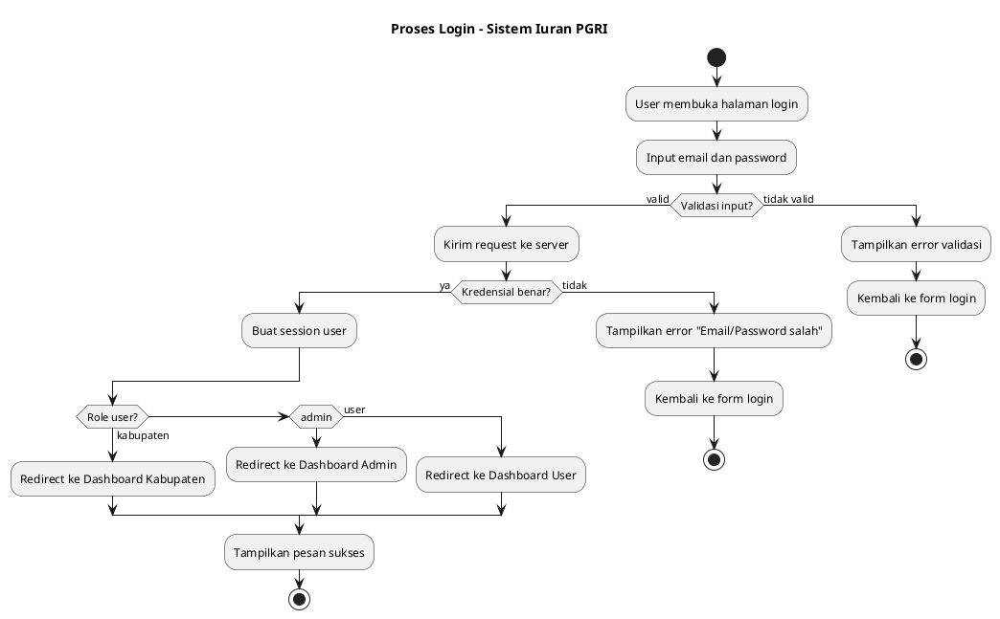
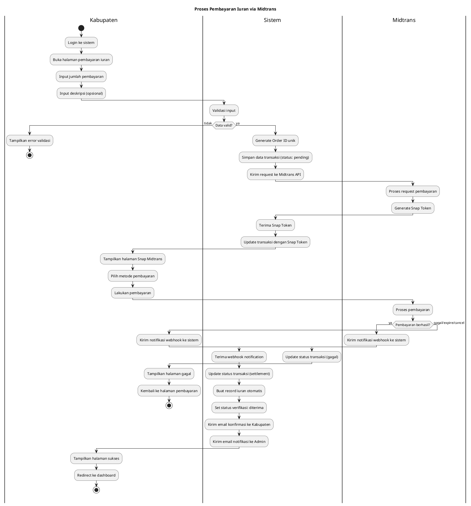
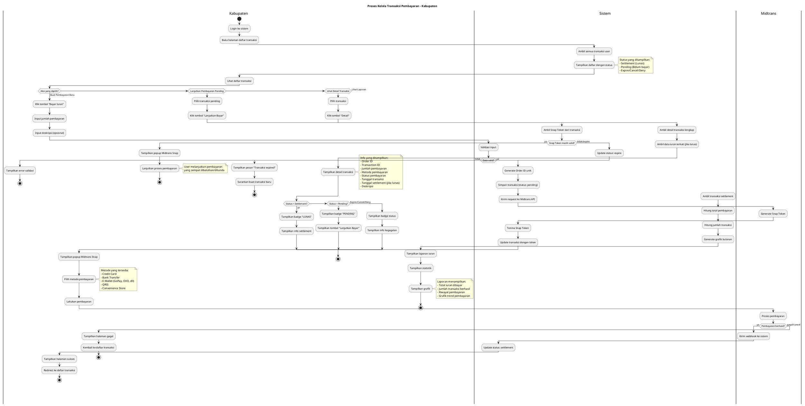
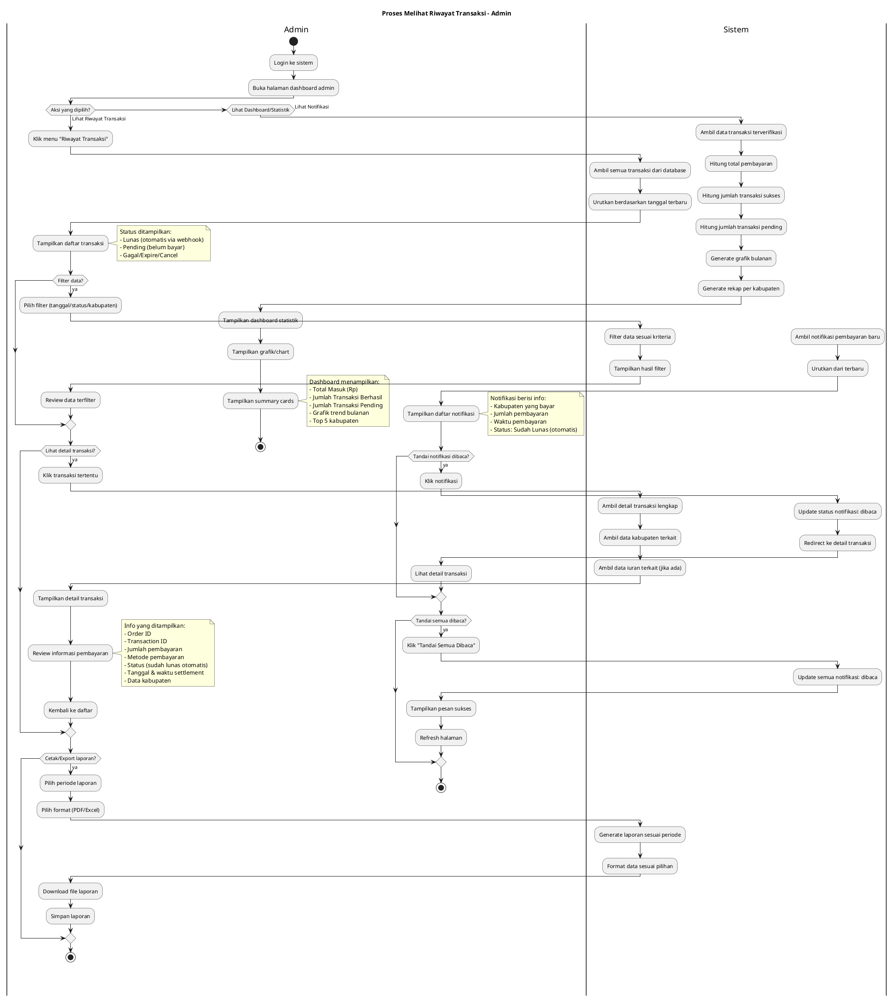
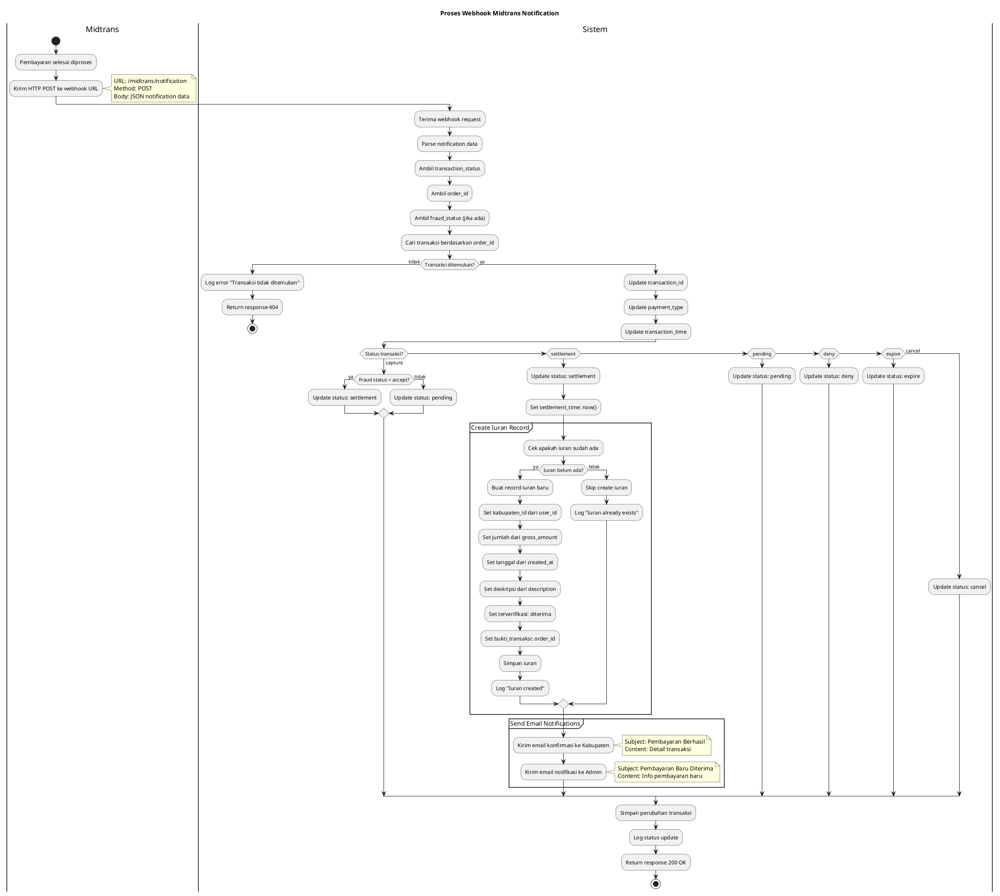

# Activity Diagram - Sistem Iuran PGRI

## Daftar Activity Diagram

Dokumen ini berisi beberapa activity diagram untuk proses-proses utama dalam Sistem Iuran PGRI:

1. [Proses Login](#1-proses-login)
2. [Proses Pembayaran Iuran via Midtrans (Kabupaten)](#2-proses-pembayaran-iuran-via-midtrans-kabupaten)
3. [Proses Kelola Transaksi Pembayaran (Kabupaten)](#3-proses-kelola-transaksi-pembayaran-kabupaten)
4. [Proses Melihat Riwayat Transaksi (Admin)](#4-proses-melihat-riwayat-transaksi-admin)
5. [Proses Webhook Midtrans](#5-proses-webhook-midtrans)

---

## 1. Proses Login

### Deskripsi
Activity diagram untuk proses autentikasi pengguna (Kabupaten dan Admin)

### PlantUML Code

---

## 2. Proses Pembayaran Iuran via Midtrans (Kabupaten)

### Deskripsi
Activity diagram untuk proses pembayaran iuran menggunakan Midtrans Payment Gateway

### PlantUML Code

---

## 3. Proses Kelola Transaksi Pembayaran (Kabupaten)

### Deskripsi
Activity diagram untuk proses kelola transaksi pembayaran via Midtrans (view, continue payment, view detail). Tidak ada upload bukti manual karena sistem sudah terintegrasi dengan Midtrans.

### PlantUML Code

---

## 4. Proses Melihat Riwayat Transaksi (Admin)

### Deskripsi
Activity diagram untuk proses monitoring dan melihat riwayat transaksi yang sudah otomatis terverifikasi via webhook Midtrans. Admin hanya melakukan view/read, tidak ada action untuk mengubah status pembayaran.

### PlantUML Code

---

## 5. Proses Webhook Midtrans

### Deskripsi
Activity diagram untuk proses handling webhook notification dari Midtrans

### PlantUML Code

---

## Cara Menggunakan

1. Buka [plantuml.com](https://www.plantuml.com/plantuml/uml/)
2. Pilih salah satu diagram yang ingin ditampilkan
3. Salin kode PlantUML (dari `@startuml` sampai `@enduml`)
4. Paste di editor PlantUML
5. Diagram akan otomatis ter-generate
6. Download diagram dalam format PNG, SVG, atau format lainnya

## Penjelasan Diagram

### 1. Proses Login
- Menggambarkan alur autentikasi user
- Validasi kredensial
- Redirect berdasarkan role (kabupaten/admin/user)

### 2. Proses Pembayaran via Midtrans
- Alur lengkap pembayaran dari input sampai konfirmasi
- Integrasi dengan Midtrans Snap
- Webhook notification handling
- Auto-create iuran record
- Email notification otomatis

### 3. Proses Kelola Transaksi Pembayaran
- **View daftar transaksi** dengan berbagai status (Settlement/Pending/Expire)
- **Buat pembayaran baru** via Midtrans (tidak ada upload bukti manual)
- **Lanjutkan pembayaran pending** yang sempat dibatalkan
- **Lihat detail transaksi** dengan info lengkap dari Midtrans
- **Lihat laporan** dan statistik pembayaran
- **Tidak ada CRUD manual** - semua via Midtrans

### 4. Proses Melihat Riwayat Transaksi (Admin)
- **Monitoring only** - Admin tidak melakukan approval manual
- View dan filter riwayat transaksi yang sudah otomatis lunas via webhook
- Export/cetak laporan transaksi
- Lihat dashboard statistik dan grafik
- Kelola notifikasi pembayaran (mark as read)
- **Tidak ada action untuk mengubah status pembayaran** (sudah otomatis)

### 5. Proses Webhook Midtrans
- Technical flow webhook handling
- Status mapping dari Midtrans
- **Auto-verification** untuk pembayaran Midtrans (tanpa campur tangan admin)
- Auto-create iuran record dengan status 'diterima'
- Email notification trigger

## Catatan

- Semua diagram menggunakan **swimlane** untuk memisahkan actor/sistem
- Menggunakan **decision node** untuk conditional flow
- Menggunakan **partition** untuk grouping proses terkait
- Menggunakan **note** untuk informasi tambahan
- Diagram dibuat berdasarkan implementasi aktual di controllers

## Teknologi yang Digunakan

- **Laravel**: Framework backend
- **Inertia.js**: Frontend framework
- **Midtrans**: Payment gateway
- **Email Notification**: Laravel Mail
- **Database**: MySQL/PostgreSQL
