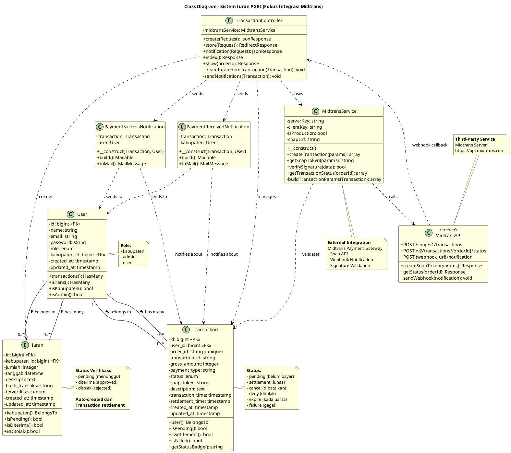
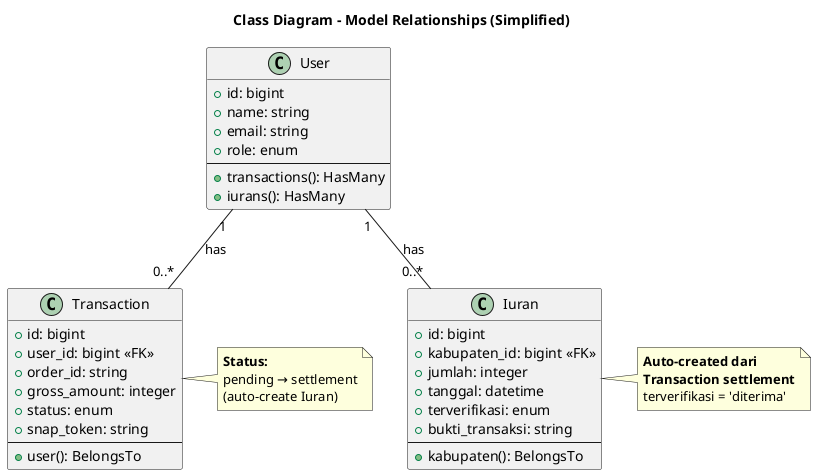

# Class Diagram - Sistem Iuran PGRI

## Deskripsi

Dokumen ini berisi **class diagram** untuk Sistem Iuran PGRI yang menggambarkan struktur class, attributes, methods, dan relationships antar class dalam sistem. Diagram ini **fokus pada fitur utama**: **Pembayaran via Midtrans** dan **Webhook Notification**.

---

## Class Diagram Utama - Fokus Integrasi Midtrans

### Deskripsi
Diagram ini menunjukkan **class-class utama** yang terlibat dalam proses pembayaran via Midtrans dan handling webhook notification. Ini adalah **core classes** yang menjawab rumusan masalah skripsi.

### PlantUML Code



---

## Penjelasan Class Diagram

### 1. Model Classes (Database Entities)

#### **User**
**Deskripsi:** Merepresentasikan pengguna sistem (Kabupaten, Admin, User)

**Attributes:**
- `id`: Primary key
- `name`: Nama pengguna
- `email`: Email untuk login dan notifikasi
- `password`: Password terenkripsi
- `role`: Role pengguna (kabupaten/admin/user)
- `kabupaten_id`: ID kabupaten (untuk role kabupaten)

**Methods:**
- `transactions()`: Relasi ke Transaction (HasMany)
- `iurans()`: Relasi ke Iuran (HasMany)
- `isKabupaten()`: Check apakah user adalah kabupaten
- `isAdmin()`: Check apakah user adalah admin

**Relationships:**
- **1 User → Many Transactions**: Satu user bisa punya banyak transaksi
- **1 User → Many Iurans**: Satu kabupaten bisa punya banyak iuran

---

#### **Transaction**
**Deskripsi:** Merepresentasikan transaksi pembayaran via Midtrans

**Attributes:**
- `id`: Primary key
- `user_id`: Foreign key ke User
- `order_id`: Order ID unik dari sistem (format: ORDER-{timestamp}-{user_id})
- `transaction_id`: Transaction ID dari Midtrans
- `gross_amount`: Jumlah pembayaran
- `payment_type`: Jenis pembayaran (bank_transfer, gopay, credit_card, dll)
- `status`: Status transaksi (pending, settlement, cancel, dll)
- `snap_token`: Token dari Midtrans untuk payment page
- `description`: Deskripsi pembayaran
- `transaction_time`: Waktu transaksi dibuat
- `settlement_time`: Waktu pembayaran selesai

**Methods:**
- `user()`: Relasi ke User (BelongsTo)
- `isPending()`: Check status pending
- `isSettlement()`: Check status settlement (lunas)
- `isFailed()`: Check status gagal
- `getStatusBadge()`: Get badge HTML untuk status

**Status Flow:**
1. **pending** → Transaksi dibuat, belum bayar
2. **settlement** → Pembayaran berhasil (auto-create iuran)
3. **cancel/deny/expire/failure** → Pembayaran gagal

---

#### **Iuran**
**Deskripsi:** Merepresentasikan data iuran yang sudah dibayar

**Attributes:**
- `id`: Primary key
- `kabupaten_id`: Foreign key ke User (kabupaten)
- `jumlah`: Jumlah iuran
- `tanggal`: Tanggal iuran
- `deskripsi`: Deskripsi iuran
- `bukti_transaksi`: Order ID dari Transaction (sebagai bukti)
- `terverifikasi`: Status verifikasi (pending/diterima/ditolak)

**Methods:**
- `kabupaten()`: Relasi ke User (BelongsTo)
- `isPending()`: Check status pending
- `isDiterima()`: Check status diterima
- `isDitolak()`: Check status ditolak

**Auto-Creation:**
- Iuran **otomatis dibuat** saat Transaction status = settlement
- Status `terverifikasi` langsung **'diterima'** (tanpa approval manual)

---

### 2. Controller Classes

#### **TransactionController**
**Deskripsi:** Controller utama untuk handle pembayaran via Midtrans dan webhook

**Dependencies:**
- `MidtransService`: Service untuk komunikasi dengan Midtrans API

**Methods:**

**1. create(Request): JsonResponse**
- Menampilkan form pembayaran
- Return view dengan data user

**2. store(Request): RedirectResponse**
- **Input**: jumlah, deskripsi
- **Proses**:
  1. Validasi input
  2. Generate Order ID unik
  3. Simpan Transaction (status: pending)
  4. Request Snap Token ke Midtrans
  5. Update Transaction dengan Snap Token
- **Output**: Redirect ke halaman dengan Snap Token

**3. notification(Request): JsonResponse**
- **Input**: Webhook notification dari Midtrans
- **Proses**:
  1. Parse notification data
  2. Validasi signature
  3. Find Transaction by order_id
  4. Update status Transaction
  5. Jika settlement → createIuranFromTransaction()
  6. Send email notifications
- **Output**: HTTP 200 OK

**4. index(): Response**
- Menampilkan daftar transaksi user
- Filter by status

**5. show(orderId): Response**
- Menampilkan detail transaksi
- Include payment info dari Midtrans

**Private Methods:**

**6. createIuranFromTransaction(Transaction): void**
- **Proses**:
  1. Check apakah Iuran sudah ada (by bukti_transaksi)
  2. Jika belum ada:
     - Get kabupaten_id dari user_id
     - Create Iuran baru
     - Set terverifikasi = 'diterima'
     - Set bukti_transaksi = order_id
  3. Log hasil

**7. sendNotifications(Transaction): void**
- Send PaymentSuccessNotification ke Kabupaten
- Send PaymentReceivedNotification ke Admin

---

### 3. Service Classes

#### **MidtransService**
**Deskripsi:** Service untuk integrasi dengan Midtrans Payment Gateway

**Attributes:**
- `serverKey`: Server key dari Midtrans (untuk authentication)
- `clientKey`: Client key dari Midtrans (untuk frontend)
- `isProduction`: Flag production/sandbox mode
- `snapUrl`: URL Snap API Midtrans

**Methods:**

**1. __construct()**
- Initialize Midtrans configuration
- Set server key, client key, environment

**2. createTransaction(params): array**
- Build transaction parameters
- Return formatted params untuk Midtrans

**3. getSnapToken(params): string**
- **Input**: Transaction params (order_id, gross_amount, customer_details)
- **Proses**:
  1. Build request payload
  2. POST ke Midtrans Snap API
  3. Parse response
- **Output**: Snap Token string

**4. verifySignature(data): bool**
- **Input**: Webhook notification data
- **Proses**:
  1. Generate hash dari: order_id + status_code + gross_amount + server_key
  2. Compare dengan signature_key dari Midtrans
- **Output**: true/false

**5. getTransactionStatus(orderId): array**
- Query status transaksi ke Midtrans
- Return status info

**Private Methods:**

**6. buildTransactionParams(Transaction): array**
- Build params untuk Midtrans API
- Format: transaction_details, customer_details, item_details

---

### 4. Mail Classes

#### **PaymentSuccessNotification**
**Deskripsi:** Email notifikasi pembayaran berhasil ke Kabupaten

**Attributes:**
- `transaction`: Transaction object
- `user`: User object (Kabupaten)

**Methods:**
- `__construct(Transaction, User)`: Constructor
- `build()`: Build mailable
- `toMail()`: Build email message dengan:
  - Subject: "Pembayaran Berhasil"
  - Content: Detail transaksi (order_id, amount, status, tanggal)
  - Button: "Lihat Detail Transaksi"

---

#### **PaymentReceivedNotification**
**Deskripsi:** Email notifikasi pembayaran baru ke Admin

**Attributes:**
- `transaction`: Transaction object
- `kabupaten`: User object (Kabupaten yang bayar)

**Methods:**
- `__construct(Transaction, User)`: Constructor
- `build()`: Build mailable
- `toMail()`: Build email message dengan:
  - Subject: "Pembayaran Baru Diterima"
  - Content: Info pembayaran (kabupaten, amount, tanggal)
  - Button: "Lihat Dashboard"

---

### 5. External API

#### **MidtransAPI**
**Deskripsi:** External service dari Midtrans (Third-party)

**Endpoints:**
- `POST /snap/v1/transactions`: Create Snap Token
- `POST /v2/transactions/{orderId}/status`: Get transaction status
- `POST {webhook_url}/notification`: Send webhook notification

**Methods:**
- `createSnapToken(params)`: Generate Snap Token
- `getStatus(orderId)`: Get transaction status
- `sendWebhook(notification)`: Send webhook ke sistem

---

## Relationships (Relasi Antar Class)

### 1. Association Relationships (Database)

**User ↔ Transaction (1:N)**
- Satu User bisa memiliki banyak Transaction
- Satu Transaction belongs to satu User
- Foreign Key: `transaction.user_id → user.id`

**User ↔ Iuran (1:N)**
- Satu User (Kabupaten) bisa memiliki banyak Iuran
- Satu Iuran belongs to satu User
- Foreign Key: `iuran.kabupaten_id → user.id`

---

### 2. Dependency Relationships (Code)

**TransactionController → Transaction**
- Controller manages Transaction model
- CRUD operations

**TransactionController → Iuran**
- Controller creates Iuran from Transaction
- Auto-create saat settlement

**TransactionController → MidtransService**
- Controller uses Service untuk Midtrans API
- Get Snap Token, verify signature

**TransactionController → PaymentSuccessNotification**
- Controller sends email ke Kabupaten
- Triggered saat settlement

**TransactionController → PaymentReceivedNotification**
- Controller sends email ke Admin
- Triggered saat settlement

**MidtransService → MidtransAPI**
- Service calls external API
- HTTP requests

**MidtransAPI → TransactionController**
- API sends webhook callback
- POST /midtrans/notification

---

## Alur Lengkap (End-to-End Flow)

### **1. Pembayaran (Payment Flow)**

```
User → TransactionController.store()
  → MidtransService.getSnapToken()
    → MidtransAPI.createSnapToken()
  ← Snap Token
  → Save Transaction (status: pending)
← Redirect with Snap Token

User → Midtrans Snap Page
  → Pilih metode & bayar
  → MidtransAPI.processPayment()
```

### **2. Webhook (Notification Flow)**

```
MidtransAPI → TransactionController.notification()
  → MidtransService.verifySignature()
  → Find Transaction by order_id
  → Update Transaction status
  
  [If status = settlement]
    → createIuranFromTransaction()
      → Check duplicate
      → Create Iuran (terverifikasi: 'diterima')
    → sendNotifications()
      → PaymentSuccessNotification → Kabupaten
      → PaymentReceivedNotification → Admin
  
← HTTP 200 OK
```

---

## Diagram Alternatif - Simplified (Model Only)

Jika diagram di atas terlalu kompleks, berikut versi simplified yang fokus pada Model relationships:



---

## Cara Menggunakan

1. Buka [plantuml.com](https://www.plantuml.com/plantuml/uml/)
2. Pilih salah satu diagram:
   - **Class Diagram Utama**: Menampilkan semua class dengan methods dan relationships
   - **Simplified Model**: Fokus pada Model relationships saja
3. Salin kode PlantUML (dari `@startuml` sampai `@enduml`)
4. Paste di editor PlantUML
5. Diagram akan otomatis ter-generate
6. Download diagram dalam format PNG atau SVG

---

## Notasi UML yang Digunakan

### Class Notation
- `+` : Public method/attribute
- `-` : Private method/attribute
- `#` : Protected method/attribute

### Relationship Notation
- `--` : Association (solid line)
- `..>` : Dependency (dashed arrow)
- `"1" -- "0..*"` : Multiplicity (One-to-Many)

### Stereotypes
- `<<PK>>` : Primary Key
- `<<FK>>` : Foreign Key
- `<<unique>>` : Unique constraint
- `<<external>>` : External service/API

---

## Justifikasi untuk Skripsi

### Mengapa Class Diagram Ini Penting?

**1. Menunjukkan Struktur Sistem**
- ✅ Memvisualisasikan **class-class utama** dalam sistem
- ✅ Menunjukkan **attributes dan methods** yang diimplementasikan
- ✅ Memperjelas **relationships** antar class

**2. Menjawab Rumusan Masalah**
- ✅ **TransactionController + MidtransService** → Integrasi payment gateway
- ✅ **Webhook notification() method** → Otomasi verifikasi
- ✅ **createIuranFromTransaction()** → Auto-create iuran

**3. Menunjukkan Technical Implementation**
- ✅ **MVC Pattern** - Model, Controller, Service separation
- ✅ **External Integration** - MidtransAPI sebagai third-party
- ✅ **Email Notification** - Mail classes untuk notifikasi

**4. Nilai Akademis**
- ✅ **Design Pattern** - Service pattern, Repository pattern
- ✅ **SOLID Principles** - Single Responsibility, Dependency Injection
- ✅ **Code Organization** - Clear separation of concerns

---

## Kesimpulan

Class diagram ini **cukup dan sangat kuat** untuk laporan skripsi karena:

1. ✅ **Fokus pada fitur utama** - Pembayaran Midtrans dan Webhook
2. ✅ **Menunjukkan struktur lengkap** - Model, Controller, Service, Mail
3. ✅ **Menjawab rumusan masalah** - Integrasi dan otomasi
4. ✅ **Technical depth** - Methods, attributes, relationships
5. ✅ **Mudah dipahami** - Clear notation dan penjelasan

**Catatan:** Jika dosen meminta lebih detail, Anda bisa menambahkan class-class lain seperti Middleware, Request Validation, atau Database Migration. Namun, **diagram ini sudah mencakup core functionality** yang menjadi fokus skripsi Anda.

---

## Teknologi yang Digunakan

- **Laravel 10**: Framework backend (Eloquent ORM, Controllers, Mail)
- **Inertia.js**: Frontend framework
- **Midtrans SDK**: Payment gateway integration
- **Laravel Mail**: Email notification service
- **MySQL/PostgreSQL**: Relational database
