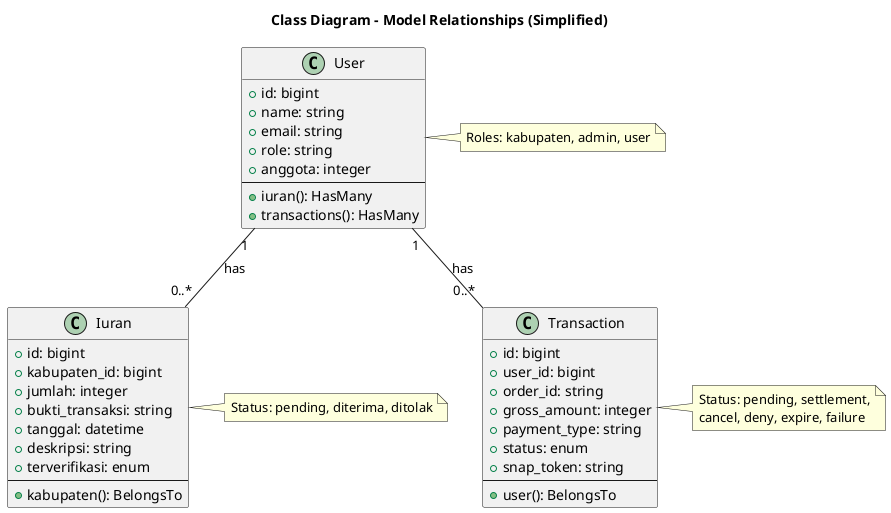
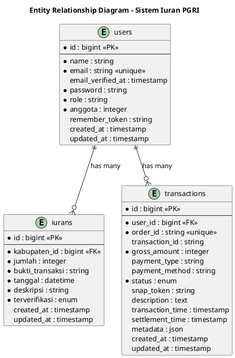

# Class Diagram - Sistem Iuran PGRI

## Deskripsi

Dokumen ini berisi class diagram untuk Sistem Iuran PGRI yang menggambarkan struktur class, attributes, methods, dan relationships antar class dalam sistem.

---

## Class Diagram Lengkap

### PlantUML Code

```plantuml
@startuml
title Class Diagram - Sistem Iuran PGRI

' Styling
skinparam classAttributeIconSize 0
skinparam class {
    BackgroundColor LightYellow
    BorderColor Black
    ArrowColor Black
}

' ===== MODEL CLASSES =====

class User {
    ' Attributes
    - id: bigint
    - name: string
    - email: string
    - email_verified_at: timestamp
    - password: string
    - role: string
    - anggota: integer
    - remember_token: string
    - created_at: timestamp
    - updated_at: timestamp
    
    ' Methods
    + iuran(): HasMany
    + transactions(): HasMany
    + isKabupaten(): bool
    + isAdmin(): bool
}

class Iuran {
    ' Attributes
    - id: bigint
    - kabupaten_id: bigint
    - jumlah: integer
    - bukti_transaksi: string
    - tanggal: datetime
    - deskripsi: string
    - terverifikasi: enum
    - created_at: timestamp
    - updated_at: timestamp
    
    ' Methods
    + kabupaten(): BelongsTo
    + isPending(): bool
    + isDiterima(): bool
    + isDitolak(): bool
}

class Transaction {
    ' Attributes
    - id: bigint
    - user_id: bigint
    - order_id: string
    - transaction_id: string
    - gross_amount: integer
    - payment_type: string
    - payment_method: string
    - status: enum
    - snap_token: string
    - description: text
    - transaction_time: timestamp
    - settlement_time: timestamp
    - metadata: json
    - created_at: timestamp
    - updated_at: timestamp
    
    ' Methods
    + user(): BelongsTo
    + isPending(): bool
    + isSuccess(): bool
    + isFailed(): bool
}

' ===== CONTROLLER CLASSES =====

class TransactionController {
    ' Methods
    + __construct()
    + create(Request): JsonResponse
    + notification(Request): JsonResponse
    + checkStatus(orderId): JsonResponse
    + index(): JsonResponse
    - createIuranFromTransaction(Transaction): void
}

class KabupatenController {
    ' Methods
    + index(): Response
    + create(): Response
    + store(Request): RedirectResponse
    + edit(id): Response
    + update(Request, Iuran): RedirectResponse
    + show(Iuran): Response
    + laporan(): Response
    + destroy(Iuran): RedirectResponse
    + showTransaction(id): Response
}

class NotifikasiController {
    ' Methods
    + index(): Response
    + show(id): Response
    + markAsRead(id): RedirectResponse
    + markAsCancel(id): RedirectResponse
    + markAllAsRead(): RedirectResponse
}

class DashboardAdminController {
    ' Methods
    + index(): Response
}

class DashboardKabupatenController {
    ' Methods
    + index(): Response
}

class LaporanController {
    ' Methods
    + index(): Response
    + create(): Response
    + store(Request): RedirectResponse
}

' ===== MAIL CLASSES =====

class PaymentSuccessNotification {
    ' Attributes
    - transaction: Transaction
    
    ' Methods
    + __construct(Transaction)
    + build(): Mailable
}

class PaymentReceivedNotification {
    ' Attributes
    - transaction: Transaction
    
    ' Methods
    + __construct(Transaction)
    + build(): Mailable
}

' ===== MIDDLEWARE CLASSES =====

class RoleMiddleware {
    ' Methods
    + handle(Request, Closure, role): mixed
}

' ===== SERVICE CLASSES =====

class MidtransService {
    ' Attributes
    - serverKey: string
    - clientKey: string
    - isProduction: bool
    
    ' Methods
    + getSnapToken(params): string
    + verifySignature(data): bool
}

' ===== RELATIONSHIPS =====

' User Relationships
User "1" -- "0..*" Iuran : has many >
User "1" -- "0..*" Transaction : has many >

' Iuran Relationships
Iuran "0..*" -- "1" User : belongs to <

' Transaction Relationships
Transaction "0..*" -- "1" User : belongs to <

' Controller Dependencies
TransactionController ..> Transaction : uses
TransactionController ..> Iuran : creates
TransactionController ..> MidtransService : uses
TransactionController ..> PaymentSuccessNotification : sends
TransactionController ..> PaymentReceivedNotification : sends

KabupatenController ..> Iuran : manages
KabupatenController ..> Transaction : views

NotifikasiController ..> Iuran : verifies

DashboardAdminController ..> Iuran : views
DashboardAdminController ..> Transaction : views

DashboardKabupatenController ..> Iuran : views
DashboardKabupatenController ..> Transaction : views

LaporanController ..> Iuran : generates report

' Mail Dependencies
PaymentSuccessNotification ..> Transaction : notifies
PaymentReceivedNotification ..> Transaction : notifies

' Middleware Dependencies
RoleMiddleware ..> User : checks role

' Notes
note right of User
    Role dapat berupa:
    - kabupaten
    - admin
    - user
end note

note right of Iuran
    Status terverifikasi:
    - pending
    - diterima
    - ditolak
end note

note right of Transaction
    Status dapat berupa:
    - pending
    - settlement
    - cancel
    - deny
    - expire
    - failure
end note

note bottom of MidtransService
    External service untuk
    payment gateway integration
end note

@enduml
```

---

## Penjelasan Class Diagram

### 1. Model Classes

#### User
- **Attributes**: Data pengguna termasuk credentials dan role
- **Methods**: 
  - `iuran()`: Relasi HasMany ke Iuran
  - `transactions()`: Relasi HasMany ke Transaction
  - `isKabupaten()`, `isAdmin()`: Helper methods untuk check role
- **Role**: kabupaten, admin, user

#### Iuran
- **Attributes**: Data iuran/pembayaran dari kabupaten
- **Methods**:
  - `kabupaten()`: Relasi BelongsTo ke User
  - `isPending()`, `isDiterima()`, `isDitolak()`: Status checkers
- **Status**: pending, diterima, ditolak

#### Transaction
- **Attributes**: Data transaksi pembayaran via Midtrans
- **Methods**:
  - `user()`: Relasi BelongsTo ke User
  - `isPending()`, `isSuccess()`, `isFailed()`: Status checkers
- **Status**: pending, settlement, cancel, deny, expire, failure

### 2. Controller Classes

#### TransactionController
- Mengelola transaksi pembayaran via Midtrans
- Create transaction, handle webhook, check status
- Auto-create iuran dari transaction sukses

#### KabupatenController
- CRUD operations untuk data iuran
- Manage iuran manual dengan upload bukti
- View laporan iuran

#### NotifikasiController
- Verifikasi pembayaran oleh admin
- Approve/reject iuran
- Bulk approve operations

#### DashboardAdminController & DashboardKabupatenController
- Menampilkan dashboard dengan statistik
- View summary dan recent transactions

#### LaporanController
- Generate laporan iuran
- Statistik dan rekap bulanan

### 3. Mail Classes

#### PaymentSuccessNotification
- Email konfirmasi pembayaran sukses ke Kabupaten
- Berisi detail transaksi

#### PaymentReceivedNotification
- Email notifikasi pembayaran baru ke Admin
- Berisi info pembayaran dari kabupaten

### 4. Middleware Classes

#### RoleMiddleware
- Memvalidasi role user untuk akses route
- Redirect jika role tidak sesuai

### 5. Service Classes

#### MidtransService
- Integration dengan Midtrans Payment Gateway
- Generate Snap Token
- Verify webhook signature

## Relationships

### One-to-Many Relationships
- **User → Iuran**: Satu user (kabupaten) memiliki banyak iuran
- **User → Transaction**: Satu user memiliki banyak transaksi

### Dependency Relationships
- Controllers menggunakan Models untuk data operations
- TransactionController menggunakan MidtransService untuk payment
- Controllers mengirim Mail notifications
- Middleware memeriksa User role

## Diagram Alternatif - Simplified

Jika diagram di atas terlalu kompleks, berikut versi simplified yang fokus pada Model relationships:

---

## Database Schema (ERD Style)

Untuk melihat struktur database dalam bentuk ERD:

---

## Cara Menggunakan

1. Buka [plantuml.com](https://www.plantuml.com/plantuml/uml/)
2. Pilih salah satu diagram yang ingin ditampilkan:
   - **Class Diagram Lengkap**: Menampilkan semua class dengan methods
   - **Simplified Model**: Fokus pada Model relationships
   - **ERD Style**: Database schema view
3. Salin kode PlantUML (dari `@startuml` sampai `@enduml`)
4. Paste di editor PlantUML
5. Diagram akan otomatis ter-generate
6. Download diagram dalam format PNG, SVG, atau format lainnya

## Notasi UML

### Class Notation
- `+` : Public
- `-` : Private
- `#` : Protected
- `~` : Package

### Relationship Notation
- `--` : Association
- `-->` : Dependency
- `--|>` : Inheritance
- `"1" -- "0..*"` : Multiplicity (One-to-Many)

### Stereotypes
- `<<PK>>` : Primary Key
- `<<FK>>` : Foreign Key
- `<<unique>>` : Unique constraint

## Catatan

- **Model Classes** merepresentasikan database tables dengan Eloquent ORM
- **Controller Classes** menangani business logic dan HTTP requests
- **Mail Classes** untuk email notifications
- **Middleware Classes** untuk authorization dan authentication
- **Service Classes** untuk external integrations (Midtrans)

## Teknologi yang Digunakan

- **Laravel Eloquent ORM**: Model relationships
- **Inertia.js**: Frontend rendering
- **Midtrans SDK**: Payment gateway
- **Laravel Mail**: Email notifications
- **MySQL/PostgreSQL**: Database

## Relasi Antar Class

### User ↔ Iuran
- **Type**: One-to-Many
- **Description**: Satu kabupaten dapat memiliki banyak iuran

### User ↔ Transaction
- **Type**: One-to-Many
- **Description**: Satu user dapat memiliki banyak transaksi pembayaran

### TransactionController → Iuran
- **Type**: Dependency
- **Description**: TransactionController membuat Iuran otomatis dari Transaction sukses

### Controllers → Models
- **Type**: Dependency
- **Description**: Controllers menggunakan Models untuk data operations
