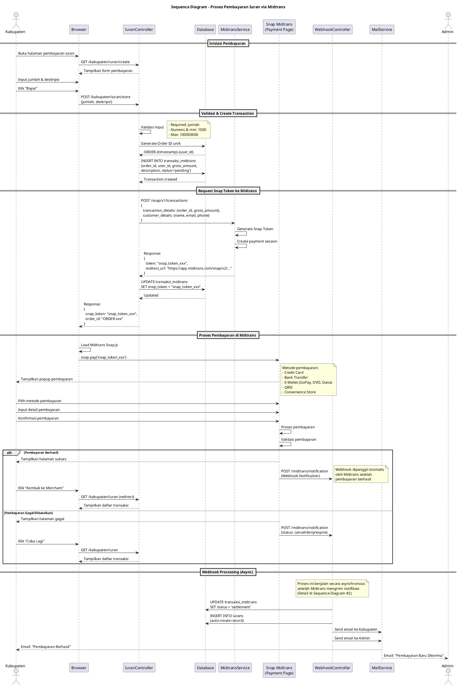
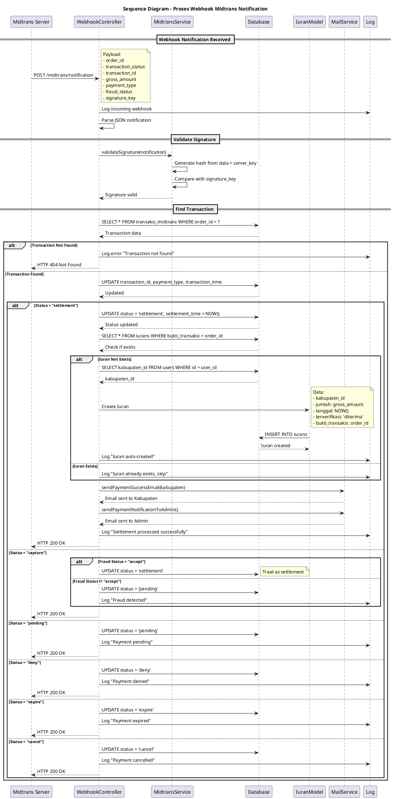

# Sequence Diagram - Sistem Iuran PGRI

## Daftar Sequence Diagram

Dokumen ini berisi **2 sequence diagram utama** yang merepresentasikan proses inti dalam Sistem Iuran PGRI:

1. [Sequence Diagram: Proses Pembayaran Iuran via Midtrans](#1-sequence-diagram-proses-pembayaran-iuran-via-midtrans)
2. [Sequence Diagram: Proses Webhook Midtrans Notification](#2-sequence-diagram-proses-webhook-midtrans-notification)

---

## 1. Sequence Diagram: Proses Pembayaran Iuran via Midtrans

### Deskripsi
Diagram ini menunjukkan **interaksi antar komponen sistem** saat Kabupaten melakukan pembayaran iuran melalui Midtrans Payment Gateway. Diagram mencakup:
- Request pembayaran dari user
- Komunikasi dengan Midtrans API
- Proses pembayaran melalui Snap
- Webhook notification handling
- Auto-create iuran record
- Email notification

### PlantUML Code

### Penjelasan Detail

#### Participants (Objek yang Terlibat):
1. **Kabupaten (Actor)**: User yang melakukan pembayaran
2. **Browser**: Interface pengguna (React/Inertia.js)
3. **IuranController**: Controller Laravel untuk handle request pembayaran
4. **Database**: MySQL/PostgreSQL untuk penyimpanan data transaksi
5. **MidtransService**: Service untuk komunikasi dengan Midtrans API
6. **Snap Midtrans**: Payment page dari Midtrans (external)
7. **WebhookController**: Controller untuk handle webhook notification
8. **MailService**: Service untuk kirim email (Laravel Mail)
9. **Admin (Actor)**: Penerima notifikasi email

#### Alur Proses:

**1. Inisiasi Pembayaran (Lines 1-10)**
- User membuka halaman pembayaran
- Input jumlah dan deskripsi
- Submit form pembayaran

**2. Validasi & Create Transaction (Lines 11-18)**
- Sistem validasi input (required, numeric, min/max)
- Generate Order ID unik dengan format: `ORDER-{timestamp}-{user_id}`
- Insert data transaksi ke database dengan status `pending`

**3. Request Snap Token (Lines 19-28)**
- Kirim request ke Midtrans API dengan data:
  - `transaction_details`: order_id, gross_amount
  - `customer_details`: name, email, phone
- Midtrans generate Snap Token
- Update transaksi dengan Snap Token
- Return token ke browser

**4. Proses Pembayaran (Lines 29-45)**
- Browser load Midtrans Snap.js library
- Tampilkan popup pembayaran dengan berbagai metode
- User pilih metode dan konfirmasi pembayaran
- Midtrans proses pembayaran

**5. Webhook Processing (Lines 46-54)**
- Jika berhasil: Midtrans kirim webhook notification
- Sistem update status transaksi
- Auto-create iuran record
- Kirim email notifikasi ke Kabupaten dan Admin

#### Keunggulan yang Ditunjukkan:
- ✅ **Otomasi penuh** dari input hingga verifikasi
- ✅ **Real-time notification** via webhook
- ✅ **No manual intervention** needed
- ✅ **Secure payment** dengan Snap Token
- ✅ **Multiple payment methods** (Credit Card, Bank Transfer, E-Wallet, QRIS)

---

## 2. Sequence Diagram: Proses Webhook Midtrans Notification

### Deskripsi
Diagram ini menunjukkan **detail proses handling webhook notification** dari Midtrans. Ini adalah **inti dari otomasi sistem** yang menggantikan verifikasi manual. Diagram mencakup:
- Parsing notification data
- Validasi signature (security)
- Status mapping
- Auto-verification logic
- Auto-create iuran record
- Email notification trigger

### PlantUML Code

### Penjelasan Detail

#### Participants (Objek yang Terlibat):
1. **Midtrans Server**: Server Midtrans yang mengirim webhook
2. **WebhookController**: Endpoint `/midtrans/notification` di Laravel
3. **MidtransService**: Service untuk validasi signature
4. **Database**: Penyimpanan data transaksi dan iuran
5. **Iuran Model**: Model Eloquent untuk create record iuran
6. **MailService**: Service untuk kirim email
7. **Log**: System logging untuk debugging

#### Alur Proses:

**1. Webhook Notification Received (Lines 1-6)**
- Midtrans kirim POST request ke `/midtrans/notification`
- Payload berisi: order_id, transaction_status, transaction_id, gross_amount, payment_type, transaction_time, fraud_status, signature_key
- Sistem log incoming webhook untuk audit trail

**2. Parse & Validate Notification (Lines 7-14)**
- Parse JSON notification data
- Extract data penting (order_id, status, fraud_status)
- **Validasi signature** untuk keamanan:
  - Generate hash dari data + server_key
  - Compare dengan signature_key dari Midtrans
  - Jika tidak match → reject request (prevent fraud)

**3. Find Transaction (Lines 15-22)**
- Cari transaksi berdasarkan order_id
- Jika tidak ditemukan → return HTTP 404
- Jika ditemukan → lanjut proses

**4. Update Transaction Data (Lines 23-26)**
- Update transaction_id dari Midtrans
- Update payment_type (bank_transfer, gopay, credit_card, dll)
- Update transaction_time

**5. Process Transaction Status (Lines 27-70)**

**Status Mapping:**

| Midtrans Status | Action | Sistem Status |
|----------------|--------|---------------|
| `capture` + fraud=accept | Update status, create iuran | `settlement` |
| `capture` + fraud≠accept | Update status, pending review | `pending` |
| `settlement` | Update status, create iuran, send email | `settlement` |
| `pending` | Update status | `pending` |
| `deny` | Update status | `deny` |
| `expire` | Update status | `expire` |
| `cancel` | Update status | `cancel` |

**6. Auto-Create Iuran Record (Lines 35-50)**
- **Cek duplikasi**: Query iuran berdasarkan bukti_transaksi (order_id)
- **Jika belum ada**:
  - Get kabupaten_id dari user_id
  - Create record iuran baru dengan:
    - `kabupaten_id`: dari user
    - `jumlah`: dari gross_amount
    - `tanggal`: NOW()
    - `deskripsi`: dari description
    - `terverifikasi`: **'diterima'** (auto-approved!)
    - `bukti_transaksi`: order_id
  - Log "Iuran auto-created"
- **Jika sudah ada**: Skip create (idempotency)

**7. Send Email Notifications (Lines 51-64)**
- **Parallel processing** untuk efisiensi
- Email ke Kabupaten:
  - Subject: "Pembayaran Berhasil"
  - Content: Detail transaksi (order_id, amount, status)
- Email ke Admin:
  - Subject: "Pembayaran Baru Diterima"
  - Content: Info pembayaran baru (kabupaten, amount, date)

**8. Response (Lines 65-70)**
- Log status update
- Return HTTP 200 OK ke Midtrans
- Midtrans akan retry jika tidak dapat 200 OK

#### Keunggulan yang Ditunjukkan:

**1. Security (Keamanan)**
- ✅ Signature validation untuk mencegah fraud
- ✅ Hanya terima request dari Midtrans server
- ✅ Validasi order_id sebelum proses

**2. Automation (Otomasi)**
- ✅ **Auto-verification** - Tanpa campur tangan admin
- ✅ **Auto-create iuran** - Langsung status 'diterima'
- ✅ **Auto-notification** - Email otomatis ke Kabupaten & Admin

**3. Reliability (Keandalan)**
- ✅ **Idempotency** - Cek duplikasi sebelum create
- ✅ **Error handling** - Logging untuk debugging
- ✅ **Status mapping** - Handle semua kemungkinan status

**4. Performance (Performa)**
- ✅ **Parallel email sending** - Kirim email bersamaan
- ✅ **Asynchronous processing** - Tidak block user experience
- ✅ **Efficient queries** - Minimal database hits

**5. Audit Trail**
- ✅ **Comprehensive logging** - Log setiap step
- ✅ **Transaction history** - Semua perubahan status tercatat
- ✅ **Email records** - Bukti notifikasi terkirim

---

## Perbandingan: Activity vs Sequence Diagram

| Aspek | Activity Diagram | Sequence Diagram |
|-------|------------------|------------------|
| **Fokus** | Alur proses/workflow | Interaksi antar objek |
| **Timeline** | Tidak ada timeline | Ada timeline (top-down) |
| **Swimlane** | Actor/Sistem/Pihak Ketiga | Participant/Object |
| **Detail Teknis** | Rendah-Sedang | Tinggi |
| **Use Case** | Menjelaskan "apa yang terjadi" | Menjelaskan "bagaimana terjadi" |
| **Audience** | Business stakeholder | Technical team |

**Untuk Skripsi:**
- **Activity Diagram** → Untuk menjelaskan business process ke pembimbing/penguji
- **Sequence Diagram** → Untuk menunjukkan technical implementation detail

---

## Cara Menggunakan

1. Buka [plantuml.com](https://www.plantuml.com/plantuml/uml/)
2. Pilih salah satu diagram yang ingin ditampilkan
3. Salin kode PlantUML (dari `@startuml` sampai `@enduml`)
4. Paste di editor PlantUML
5. Diagram akan otomatis ter-generate
6. Download diagram dalam format PNG atau SVG

**Alternative Tools:**
- **VS Code Extension**: PlantUML (joekreydt.vscode-plantuml)
- **IntelliJ IDEA**: PlantUML integration plugin
- **Online Editor**: [PlantText](https://www.planttext.com/)

---

## Justifikasi untuk Skripsi

### Mengapa 2 Sequence Diagram Ini Penting?

**1. Sequence Diagram #1: Pembayaran via Midtrans**
- ✅ Menunjukkan **integrasi dengan pihak ketiga** (Midtrans API)
- ✅ Membuktikan **kompleksitas teknis** implementasi
- ✅ Menjelaskan **flow komunikasi** antar komponen
- ✅ Menjawab pertanyaan: *"Bagaimana sistem berkomunikasi dengan Midtrans?"*
- ✅ Menunjukkan **end-to-end flow** dari user input hingga email notification

**2. Sequence Diagram #2: Webhook Notification**
- ✅ Menunjukkan **inti dari otomasi** sistem
- ✅ Membuktikan **tidak ada verifikasi manual**
- ✅ Menjelaskan **auto-create iuran logic**
- ✅ Menjawab pertanyaan: *"Bagaimana sistem memverifikasi pembayaran secara otomatis?"*
- ✅ Menunjukkan **security consideration** (signature validation)

### Nilai Akademis

Kedua sequence diagram ini menunjukkan:

1. **Technical Depth** - Detail implementasi hingga level method/function
2. **System Integration** - Komunikasi dengan external API (Midtrans)
3. **Automation Logic** - Webhook handling dan auto-verification
4. **Security Consideration** - Signature validation, fraud detection
5. **Error Handling** - Logging dan exception handling
6. **Scalability** - Asynchronous processing, parallel email sending
7. **Data Integrity** - Idempotency check, transaction management

### Menjawab Rumusan Masalah

**Rumusan Masalah 1**: *"Bagaimana mengintegrasikan payment gateway untuk mempercepat proses pembayaran?"*
- **Dijawab oleh**: Sequence Diagram #1
- **Bukti**: Flow lengkap dari request Snap Token hingga pembayaran berhasil

**Rumusan Masalah 2**: *"Bagaimana mengotomasi verifikasi pembayaran untuk mengurangi waktu tunggu?"*
- **Dijawab oleh**: Sequence Diagram #2
- **Bukti**: Webhook handling yang auto-create iuran dengan status 'diterima' tanpa approval manual

---

## Catatan Teknis

### Notasi PlantUML yang Digunakan:

- `->` : **Synchronous message** (request)
- `-->` : **Return message** (response)
- `alt/else/end` : **Alternative flow** (conditional)
- `par/and/end` : **Parallel processing**
- `loop/end` : **Loop/iteration**
- `note right/left` : **Catatan tambahan**
- `participant` : **Object/komponen** dalam sistem
- `actor` : **User/external entity**

### Best Practices:

1. **Urutan Participants**: Dari kiri ke kanan sesuai flow
2. **Activation Bar**: Otomatis ditampilkan saat ada message
3. **Return Message**: Gunakan dashed arrow (`-->`)
4. **Grouping**: Gunakan `== Section Name ==` untuk grouping
5. **Notes**: Tambahkan note untuk penjelasan teknis

---

## Teknologi yang Digunakan

- **Laravel 10**: Framework backend (Controller, Model, Service)
- **Inertia.js**: Frontend framework (Browser interaction)
- **React/TypeScript**: UI components
- **Midtrans Snap**: Payment gateway API
- **MySQL/PostgreSQL**: Relational database
- **Laravel Mail**: Email notification service (SMTP)
- **Monolog**: Logging service
- **Laravel Queue**: Asynchronous job processing (optional)

---

## Referensi

1. **Midtrans Documentation**: https://docs.midtrans.com/
2. **PlantUML Sequence Diagram**: https://plantuml.com/sequence-diagram
3. **Laravel Documentation**: https://laravel.com/docs/10.x
4. **UML Sequence Diagram Best Practices**: https://www.uml-diagrams.org/sequence-diagrams.html

---

## Kesimpulan

Kedua sequence diagram ini **cukup dan sangat kuat** untuk laporan skripsi karena:

1. ✅ **Fokus pada fitur utama** - Integrasi Midtrans dan otomasi verifikasi
2. ✅ **Detail teknis tinggi** - Menunjukkan implementasi hingga level method
3. ✅ **Menjawab rumusan masalah** - Langsung address pain points sistem lama
4. ✅ **Menunjukkan kompleksitas** - Integrasi external API, security, automation
5. ✅ **Nilai akademis tinggi** - Technical depth yang sesuai untuk skripsi S1

**Catatan**: Jika dosen meminta lebih banyak diagram, Anda bisa menambahkan diagram "receh" seperti Login atau Lihat Laporan. Namun, **2 diagram ini adalah senjata andalan** yang menunjukkan core value dari skripsi Anda.
