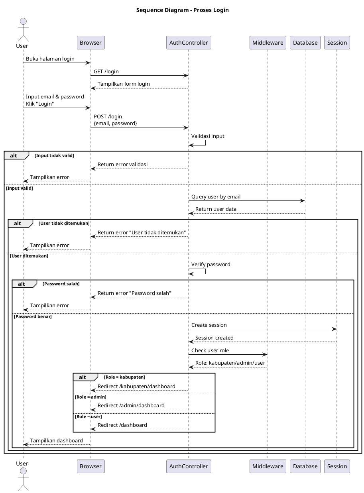
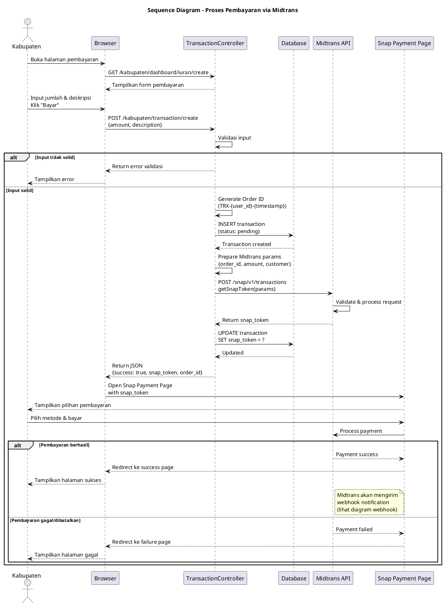
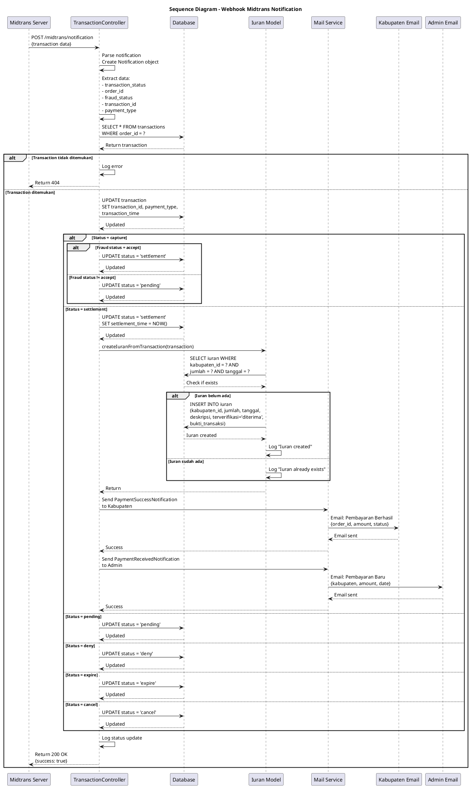
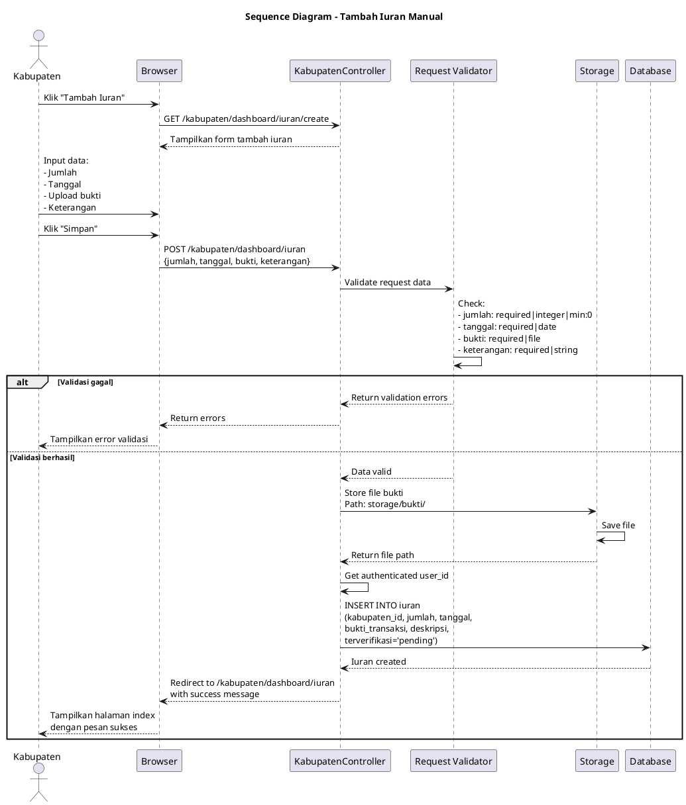
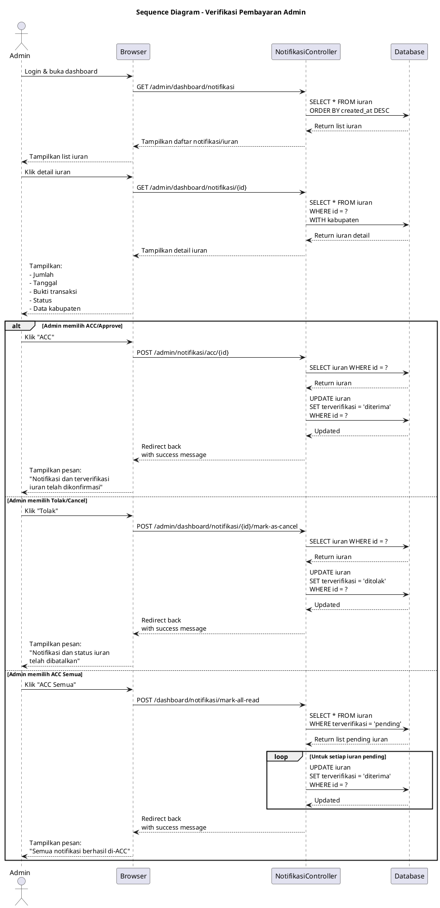
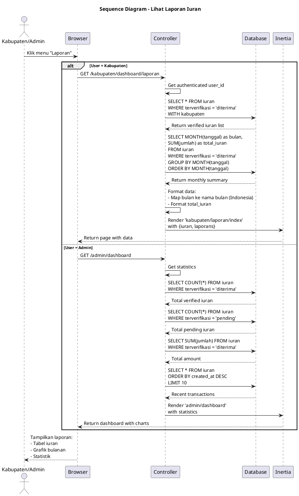

# Sequence Diagram - Sistem Iuran PGRI

## Daftar Sequence Diagram

Dokumen ini berisi beberapa sequence diagram untuk proses-proses utama dalam Sistem Iuran PGRI:

1. [Proses Login](#1-proses-login)
2. [Proses Pembayaran Iuran via Midtrans](#2-proses-pembayaran-iuran-via-midtrans)
3. [Proses Webhook Midtrans](#3-proses-webhook-midtrans)
4. [Proses Tambah Iuran Manual](#4-proses-tambah-iuran-manual)
5. [Proses Verifikasi Pembayaran oleh Admin](#5-proses-verifikasi-pembayaran-oleh-admin)
6. [Proses Lihat Laporan Iuran](#6-proses-lihat-laporan-iuran)

---

## 1. Proses Login

### Deskripsi
Sequence diagram untuk proses autentikasi pengguna (Kabupaten dan Admin)

### PlantUML Code

---

## 2. Proses Pembayaran Iuran via Midtrans

### Deskripsi
Sequence diagram untuk proses pembayaran iuran menggunakan Midtrans Payment Gateway

### PlantUML Code

---

## 3. Proses Webhook Midtrans

### Deskripsi
Sequence diagram untuk proses handling webhook notification dari Midtrans setelah pembayaran

### PlantUML Code

---

## 4. Proses Tambah Iuran Manual

### Deskripsi
Sequence diagram untuk proses menambah data iuran secara manual dengan upload bukti transfer

### PlantUML Code

---

## 5. Proses Verifikasi Pembayaran oleh Admin

### Deskripsi
Sequence diagram untuk proses verifikasi (approve/reject) pembayaran iuran oleh Admin

### PlantUML Code

---

## 6. Proses Lihat Laporan Iuran

### Deskripsi
Sequence diagram untuk proses melihat laporan iuran (untuk Kabupaten dan Admin)

### PlantUML Code

---

## Cara Menggunakan

1. Buka [plantuml.com](https://www.plantuml.com/plantuml/uml/)
2. Pilih salah satu diagram yang ingin ditampilkan
3. Salin kode PlantUML (dari `@startuml` sampai `@enduml`)
4. Paste di editor PlantUML
5. Diagram akan otomatis ter-generate
6. Download diagram dalam format PNG, SVG, atau format lainnya

## Penjelasan Diagram

### 1. Proses Login
- Menggambarkan interaksi antara User, Browser, AuthController, Middleware, Database, dan Session
- Menunjukkan alur validasi kredensial dan pembuatan session
- Redirect berdasarkan role user

### 2. Proses Pembayaran via Midtrans
- Interaksi lengkap dari input pembayaran sampai Snap Payment Page
- Komunikasi dengan Midtrans API untuk mendapatkan Snap Token
- Penyimpanan data transaksi ke database
- Flow pembayaran di Snap Midtrans

### 3. Proses Webhook Midtrans
- Detail teknis handling webhook notification dari Midtrans
- Update status transaksi berdasarkan notification
- Auto-create iuran record untuk pembayaran sukses
- Pengiriman email notification ke Kabupaten dan Admin

### 4. Proses Tambah Iuran Manual
- Alur upload dan validasi data iuran manual
- Penyimpanan file bukti transaksi ke storage
- Insert data ke database dengan status pending

### 5. Proses Verifikasi Admin
- Interaksi admin untuk approve/reject pembayaran
- Bulk approve untuk efisiensi
- Update status verifikasi di database

### 6. Proses Lihat Laporan
- Query data iuran terverifikasi
- Generate statistik dan rekap bulanan
- Render data ke view dengan Inertia.js

## Komponen Utama

### Actors
- **Kabupaten**: User dengan role kabupaten
- **Admin**: User dengan role admin

### Participants
- **Browser**: Client-side interface
- **Controllers**: TransactionController, KabupatenController, NotifikasiController, DashboardController
- **Database**: MySQL/PostgreSQL database
- **Midtrans API**: External payment gateway service
- **Mail Service**: Laravel Mail untuk email notification
- **Storage**: File storage untuk bukti transaksi
- **Inertia**: Inertia.js untuk rendering pages

## Notasi PlantUML

- `->` : Synchronous message
- `-->` : Return message
- `alt/else/end` : Alternative flow (conditional)
- `loop/end` : Loop/iteration
- `note right/left` : Catatan tambahan
- `participant` : Object/komponen dalam sistem

## Catatan

- Semua diagram menggambarkan **interaksi antar komponen** dalam urutan waktu
- Diagram dibuat berdasarkan **implementasi aktual** di controllers
- Menunjukkan **alur data** dari request sampai response
- Mencakup **error handling** dan **alternative flows**

## Teknologi yang Digunakan

- **Laravel**: Framework backend
- **Inertia.js**: Frontend framework
- **Midtrans**: Payment gateway
- **Laravel Mail**: Email notification
- **Database**: MySQL/PostgreSQL
- **Storage**: Laravel File Storage
