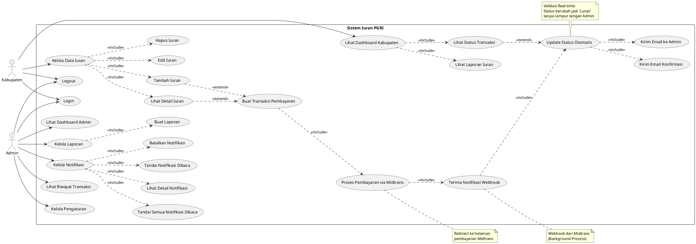

# Use Case Diagram - Sistem Iuran PGRI

## PlantUML Code

Salin kode di bawah ini dan jalankan di [plantuml.com](https://www.plantuml.com/plantuml/uml/)

## Deskripsi Use Case

### Actor

1. **Kabupaten**: Pengguna dengan role kabupaten yang mengelola iuran dan melakukan pembayaran
2. **Admin**: Administrator sistem yang mengelola keseluruhan sistem dan verifikasi pembayaran

### Use Case Utama

#### Use Cases Bersama (Shared)
- **UC1 - Login**: Masuk ke sistem dengan kredensial
- **UC2 - Logout**: Keluar dari sistem

#### Kabupaten
- **UC3 - Lihat Dashboard Kabupaten**: Melihat dashboard khusus kabupaten dengan ringkasan iuran dan transaksi
- **UC4 - Kelola Data Iuran**: Mengelola data iuran (CRUD)
  - UC5: Tambah iuran baru
  - UC6: Edit data iuran
  - UC7: Hapus data iuran
  - UC8: Lihat detail iuran
- **UC9 - Buat Transaksi Pembayaran**: Membuat transaksi pembayaran melalui Midtrans
- **UC10 - Lihat Status Transaksi**: Melihat status pembayaran transaksi yang sudah diupdate otomatis
- **UC11 - Lihat Laporan Iuran**: Melihat laporan iuran kabupaten

#### Admin
- **UC12 - Lihat Dashboard Admin**: Melihat dashboard administrator dengan statistik sistem
- **UC13 - Kelola Laporan**: Mengelola laporan sistem
  - UC14: Membuat laporan baru
- **UC15 - Kelola Notifikasi**: Mengelola notifikasi pembayaran
  - UC16: Lihat detail notifikasi
  - UC18: Tandai notifikasi sebagai dibaca (satu notifikasi)
  - UC19: Batalkan notifikasi
  - UC20: Tandai semua notifikasi sebagai dibaca (bulk action)
- **UC17 - Lihat Riwayat Transaksi**: Memantau dan melihat riwayat semua transaksi yang sudah otomatis terverifikasi
- **UC21 - Kelola Pengaturan**: Mengelola pengaturan sistem

#### Proses Sistem Internal (Otomatisasi)
- **UC22 - Proses Pembayaran via Midtrans**: Sistem memproses pembayaran melalui Midtrans Payment Gateway
- **UC23 - Terima Notifikasi Webhook**: Sistem menerima notifikasi webhook dari Midtrans (background process)
- **UC26 - Update Status Otomatis**: Sistem otomatis mengupdate status pembayaran menjadi 'Lunas' berdasarkan webhook
- **UC24 - Kirim Email Konfirmasi**: Sistem mengirim email konfirmasi pembayaran ke kabupaten
- **UC25 - Kirim Email ke Admin**: Sistem mengirim notifikasi email pembayaran baru ke admin

## Cara Menggunakan

1. Buka [plantuml.com](https://www.plantuml.com/plantuml/uml/)
2. Salin seluruh kode PlantUML di atas (dari `@startuml` sampai `@enduml`)
3. Paste di editor PlantUML
4. Diagram akan otomatis ter-generate
5. Anda bisa download diagram dalam format PNG, SVG, atau format lainnya

## Catatan

- Diagram ini menggambarkan use case berdasarkan struktur routes dan controllers yang ada di project
- Terdapat **2 role utama**: **Kabupaten** dan **Admin**
- **Midtrans** adalah **proses sistem internal** (bukan actor eksternal)
- Sistem terintegrasi dengan Midtrans Payment Gateway untuk pemrosesan pembayaran
- **Sistem otomatis** mengupdate status pembayaran menjadi 'Lunas' via webhook (tanpa approval manual admin)
- Admin hanya **memantau** transaksi, tidak melakukan approve/ACC karena sudah otomatis
- Sistem memiliki fitur email notification otomatis untuk konfirmasi pembayaran
- Webhook dari Midtrans digunakan untuk update status pembayaran secara real-time
- Terdapat 2 fitur "Tandai Dibaca": 
  - **UC18**: Tandai 1 notifikasi spesifik
  - **UC20**: Tandai semua notifikasi sekaligus (bulk action)

